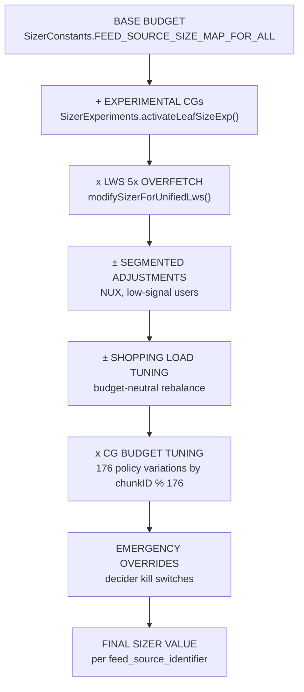
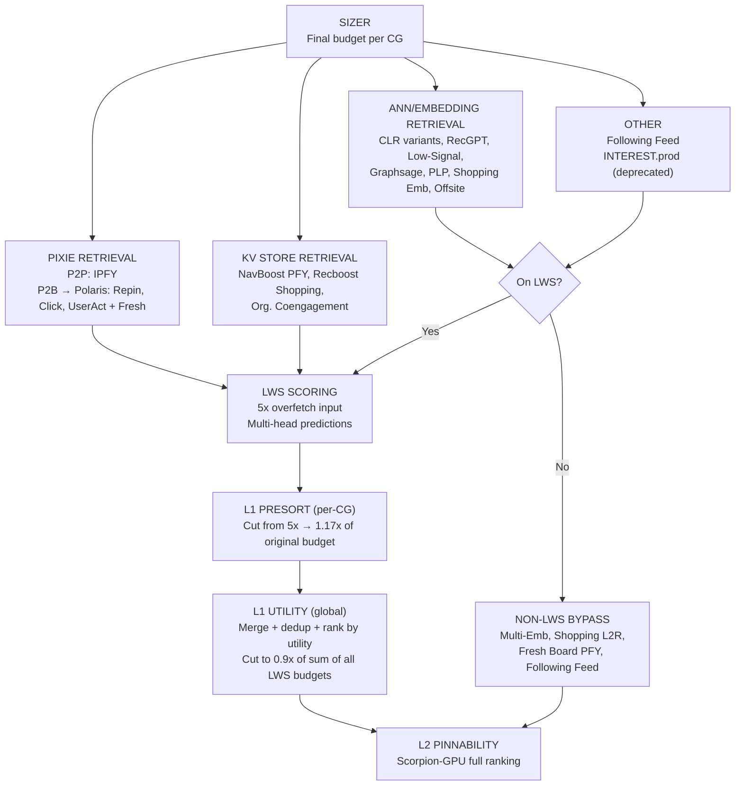

# CG/RTC Quota Distribution Analysis

*Updated 2026-04-10 from Optimus Sizer code + production telemetry + engagement data (30-day: 2026-03-10 to 2026-04-09)*

---

## System Diagrams

### Sizer Override Chain



Each layer can modify the budget set by the previous layer. The 5x LWS overfetch is the largest multiplier. The 176-variation experiment can zero out individual CG groups entirely (multiplier = 0.0).

### Candidate Generation Funnel



### Retrieval Architectures

| Architecture | How It Works | CGs |
|---|---|---|
| **Pixie P2P** | PinnerSage V2 user profile → random walk on Pixie graph → returns pins directly | IPFY (36), Offsite Search NB (223), Offsite IPFY (224) |
| **Pixie P2B → Polaris** | Through Rewards clusters → Pixie P2B walk → boards → Polaris board-to-pin service → pins | Repin Board (1), User Activity (4), Clickthrough (9), + Fresh variants (47, 49, 48) |
| **ANN/Embedding** | Embedding query → Manas ANN index → nearest neighbor pins. CLR variants use conditional embeddings (pin, board, UIC, interest conditions). PinnerSpark is a separate condition for low-signal users. | Pin CLR (232), Board CLR (220), UIC CLR (237), Pred UIC (238), Multi-Emb (210), RecGPT (206), Low-Signal (229), Graphsage (97), PLP (218), Product (195), TML (213), Fresh Product (209), PinnerSpark (231), Recommended Topics (65) |
| **KV Store** | User-level lookup in precomputed KV store of memorized engagement patterns | NavBoost PFY (89), Recboost Shopping (214), Organic Coengagement (211) |
| **Following** | Pins from followed creators | Following Feed (19) |

**Sizer interacts differently with each architecture:**
- **ANN CGs**: Sizer directly controls the ANN request count → fetched ≈ sizer
- **CLR CGs**: ANN fetch cap is hardcoded separately from sizer (see Two-Level Budget below) → fetched may be << sizer
- **KV Store CGs**: KV store returns whatever it finds; sizer controls post-retrieval filtering → fetched can be >> sizer
- **Pixie CGs**: Sizer controls retrieval budget → fetched ≈ sizer

### Funnel Math (per CG, for LWS-covered CGs)

- Sizer budget = N_i
- LWS input = 5 × N_i (5x overfetch)
- Post-presort = 1.17 × N_i (presort cuts from 5x down to 1.17x of original budget; keeps ~23% of LWS-scored candidates)
  - 1.17x = 0.9 × 1.3: the 0.9x is L1 Utility's target, the 1.3x provides headroom
- L1 Utility output = 0.9 × N_i per CG (after global merge + dedup + utility ranking)
- L1 Utility total = 0.9 × sum(N_i for all LWS CGs)
- Final L2 input = L1 Utility output + non-LWS bypass candidates

### Key Architectural Facts

- **Non-LWS CGs (bypass L1 Utility)**: Multi-Embedding (210), Shopping L2R (195, 213, 209), Fresh Board PFY, Following Feed (19)
- Non-LWS CGs go directly to L2 after dedup — no quality filtering by L1 Utility
- Board CLR has **1x sizer overfetch** (not 5x) — newly launched
- Sizer runs first, before anything else — it's a hashmap of feed_source → integer budget
- INTEREST.prod is **deprecated** — being replaced by Interest CLR (recommended interests as conditions into CLR embedding retrieval). The 956 avg sizer and high impression volume are under investigation.

### Two-Level Budget System for CLR-type CGs

For embedding/CLR CGs, there are two separate budgets:
1. **Sizer budget** → controls L1 Utility allocation (how many candidates survive post-LWS). This is what the sizer hashmap sets.
2. **ANN fetch cap** → controls how many candidates are actually retrieved from the embedding index. Set in `MuseConditionalEmbeddingsToWebPinsUtils.java`.

These can diverge. Example: UIC CLR has 750 avg final sizer but only 200 hardcoded in the ANN request. Real fill rate = 122/200 = 61%, not the misleading 122/750 = 16%.

### ANN Fetch Caps by CLR Variant

Source: `MuseConditionalEmbeddingsToWebPinsUtils.java`, `HomefeedMultiConditionalEmbeddingRetrievalManasConverterNode.java`

| CG | RTC | Sizer Budget | ANN Total Fetch | How Calculated | Conditions |
|---|---|---|---|---|---|
| Pin CLR | 232 | 200 (exp) | 200 | 200 / 9 conditions = ~22 per pin | 9 pin conditions (default) |
| Board CLR | 220 | 300 (exp) | ~450 | 300 / 8 boards × 1.5x overfetch per board | 8 boards, 1.5x CONDITIONAL_OVERFETCH_RATIO |
| UIC CLR | 237 | 150 (ship) | 200 | 200 / 5 UIC conditions = 40 per cluster | 5 UIC conditions, hardcoded 200 in grid |
| Pred UIC CLR | 238 | Variable | Variable | From exp params (sel_N, pcond_N) | Default 0 (enabled via experiment) |
| Multi-Emb | 210 | 357 (base) | N/A | Not a CLR variant — different retrieval system | N/A |

**Post-ANN filtering**: Bloom filter dedup + image signature dedup + 1.2x LEAF_OVERFETCH_RATIO at Manas request level, then capped at numCandidatesRequestedPerCondition.

### Sizer Override Chain

1. **Base budget** from `SizerConstants.FEED_SOURCE_SIZE_MAP_FOR_ALL`
2. **Experimental CGs added** via `SizerExperiments.activateLeafSizeExp()`
3. **LWS 5x overfetch** via `modifySizerForUnifiedLws()` (user-generated grid requests)
4. **Segmented budget adjustments** (NUX, low-signal users)
5. **Shopping load tuning** — cluster-based multiplier, budget-neutral (shopping up = organic down)
6. **CG budget tuning experiment** — 176 policy variations randomized by chunkID
7. **Emergency overrides** — decider kill switches

---

## CG/RTC Registry

### Budget & Retrieval by Feed Source

Sorted by avg final sizer value (descending). **Sizer and fetched values are production averages across all users.**

| Feed Source | RTC(s) | Retrieval | Avg Final Sizer | Avg Fetched | Fill% | On LWS | Status |
|---|---|---|---|---|---|---|---|
| FANTASIO.one_day_recent_action_pins | 36: IPFY | Pixie P2P | 1023 | 1002 | 98% | Yes (5x) | Active |
| FANTASIO.user_offsite_engagement_search_navboost | 223: Offsite Search NB | ANN | 1000 | 58 | **6%** | Yes (5x) | Active |
| FANTASIO.tt_conditional_pin_embedding_to_web_pins | 232: Pin CLR | ANN/CLR | 1000 | 613 | 61% | Yes (5x) | Active |
| INTEREST.prod | 65: Rec. Topics, 231: PinnerSpark | Interest taxonomy | 956 | — | — | Yes | **Deprecated** — under investigation |
| FANTASIO.tt_conditional_uic_medioid_emb_to_web_pins | 237: UIC CLR | ANN/CLR | 750 | 122 | 16% sizer / **61% ANN cap** | Yes (5x) | Active |
| FANTASIO.navboost_pfy | 89: NavBoost PFY | KV Store | 746 | 590 | 79% | Yes (5x) | Active |
| FANTASIO.tt_conditional_pred_uic_emb_to_web_pins | 238: Pred UIC CLR | ANN/CLR | 506 | 323 | 64% | Yes (5x) | Active |
| FANTASIO.offsite_ipfy | 224: Offsite IPFY | ANN | 500 | 61 | **12%** | Yes (5x) | Active |
| FANTASIO.prod | 1: Repin Board, 4: User Activity, 9: Clickthrough | Pixie P2B → Polaris | 403 | — | — | Yes (5x) | Active |
| FANTASIO.tt_multi_embedding_to_web_pins | 210: Multi-Emb | ANN | 379 | 293 | 77% | **No** | Active |
| FANTASIO.tt_conditional_board_embedding_to_web_pins | 220: Board CLR | ANN/CLR | 356 | 304 | 85% | Yes (**1x**) | Active |
| FANTASIO.fresh_from_regular_pfy | 47: Fresh Repin, 49: Fresh UserAct, 48: Fresh Click | Pixie P2B → Polaris | 341 | — | — | Partial | Active |
| FANTASIO.graphsage_product_pins | 97: Graphsage Product | ANN | 319 | 56 | **17%** | Yes (5x) | Active (legacy) |
| FANTASIO.landing_page_pixie | 18: Landing Page Pins | Pixie | 300 | 1.1 | **0.4%** | Yes | Active |
| INTEREST.first_load | 173: Embedding Best Pins | Interest taxonomy | 294 | — | — | Yes | Active |
| FANTASIO.recboost_shopping | 214: Recboost Shopping | KV Store | 219 | 23 | **11%** | Yes (5x) | Active |
| FOLLOWING_FEED.prod | 19: Following Feed | Following | 176 | — | — | **No** | Active |
| FANTASIO.tt_low_signal_user_embedding_to_web_pins | 229: Low-Signal User Emb | ANN | 149 | 135 | 91% | Yes (5x) | Active |
| FANTASIO.tt_embedding_to_plp_pins | 218: PLP Embeddings | ANN | 101 | 96 | 95% | Yes (5x) | Active |
| FANTASIO.landing_page_recboost | 188: Landing Page Recs | ANN | 100 | 0.09 | **0.1%** | Yes | Active |
| FANTASIO.recgpt_v0_user_to_pins | 206: RecGPT | ANN | 99 | 97 | **98%** | Yes (5x) | Active |
| FANTASIO.tt_embedding_to_tml_product_pins | 213: TML Product Pin Emb | ANN | 74 | 88 | 119%* | **No** | Active |
| FANTASIO.tt_embedding_to_product_pins | 195: Product Pin Emb | ANN | 41 | 49 | 121%* | **No** | Active |
| FANTASIO.organic_coengagement | 211: Organic Coengagement | KV Store | 37 | 743 | **⚠ anomaly** | Yes (5x) | **Deprecated** by Pin CLR |
| FANTASIO.tt_embedding_to_fresh_product_pins | 209: Fresh Product Pin Emb | ANN | 7 | 9 | 121%* | **No** | Active |
| FANTASIO.landing_page_pin | — | — | 7 | 0.02 | 0.3% | — | Active |
| FANTASIO.related_pins_pfy | — | — | 0 | — | — | — | Inactive |

*Fill >100% for some Shopping L2R CGs likely due to the 176-variation experiment zeroing out some users' sizer values while their fetched counts are still recorded. Or the CG has its own overfetch logic independent of sizer.

**⚠ Organic Coengagement anomaly**: 37 sizer but 743 avg fetched. KV store retrieval returns whatever it finds regardless of sizer budget. Sizer only gates downstream filtering. See [Follow-up Items](#follow-up-items).

---

## Engagement by RTC

*30-day window: 2026-03-10 to 2026-04-09. All content (shopping + organic combined). Excludes Promoted Pins (ads) and RTCs with <10K users. Source: `hf_rtc_engagement_rates_04102026.csv`.*

### All CGs by Impression Volume

| RTC | Name | Feed Source | Impressions | Repin% | Click% | Closeup% | Hide% | Repin/Hide |
|---|---|---|---|---|---|---|---|---|
| 232 | Pin CLR | tt_conditional_pin_embedding | 11.1B | 0.880% | 0.113% | 5.44% | 0.008% | 111 |
| 210 | Multi-Emb | tt_multi_embedding | 10.6B | 0.956% | 0.109% | 5.01% | 0.015% | 63 |
| 36 | IPFY | one_day_recent_action_pins | 8.0B | 0.942% | 0.087% | 4.37% | 0.009% | 104 |
| 220 | Board CLR | tt_conditional_board_embedding | 7.8B | 0.691% | 0.064% | 4.38% | 0.006% | 113 |
| 65 | Recommended Topics | INTEREST.prod (deprecated) | 5.0B | 0.777% | 0.094% | 5.31% | 0.012% | 67 |
| 237 | UIC CLR | tt_conditional_uic_medioid_emb | 3.9B | 0.963% | 0.120% | 4.82% | 0.008% | 121 |
| 89 | NavBoost PFY | navboost_pfy | 3.6B | **1.258%** | **0.175%** | 4.82% | 0.007% | **180** |
| 206 | RecGPT | recgpt_v0_user_to_pins | 3.6B | **1.210%** | 0.075% | 4.93% | 0.010% | 124 |
| 1 | Repin Board | FANTASIO.prod | 1.8B | 0.822% | 0.053% | 3.45% | 0.008% | 108 |
| 47 | Fresh Repin Board | fresh_from_regular_pfy | 1.7B | 0.988% | 0.042% | 3.61% | 0.053% | 19 |
| 4 | User Activity | FANTASIO.prod | 905M | 0.727% | 0.024% | 3.11% | 0.013% | 58 |
| 231 | PinnerSpark Interest | INTEREST.prod (deprecated) | 768M | 0.587% | 0.061% | 4.10% | 0.011% | 53 |
| 49 | Fresh User Activity | fresh_from_regular_pfy | 751M | 0.776% | 0.022% | 3.13% | 0.077% | 10 |
| 218 | PLP Embeddings | tt_embedding_to_plp_pins | 581M | **1.137%** | **0.200%** | 4.34% | 0.018% | 62 |
| 238 | Pred UIC CLR | tt_conditional_pred_uic_emb | 454M | 0.949% | 0.118% | 4.95% | 0.011% | 86 |
| 234 | Offsite Interest | — | 331M | 0.605% | 0.074% | 4.39% | 0.015% | 40 |
| 19 | Following Feed | FOLLOWING_FEED.prod | 325M | 0.234% | 0.081% | 1.47% | 0.041% | 6 |
| 211 | Organic Coengagement | organic_coengagement | 319M | 0.811% | 0.093% | 4.45% | 0.009% | 94 |
| 213 | TML Product Pin Emb | tt_embedding_to_tml_product_pins | 257M | 0.318% | 0.102% | 1.78% | 0.009% | 34 |
| 229 | Low-Signal User Emb | tt_low_signal_user_embedding | 249M | 0.597% | 0.089% | 3.75% | 0.022% | 28 |
| 97 | Graphsage Product | graphsage_product_pins | 189M | 0.545% | 0.145% | 2.43% | 0.013% | 41 |
| 195 | Product Pin Emb | tt_embedding_to_product_pins | 146M | 0.441% | 0.125% | 2.39% | 0.008% | 57 |
| 214 | Recboost Shopping | recboost_shopping | 140M | **1.214%** | **0.167%** | 3.62% | 0.005% | **221** |
| 9 | Clickthrough | FANTASIO.prod | 103M | 0.170% | 0.124% | 2.46% | 0.005% | 37 |
| 48 | Fresh Clickthrough | fresh_from_regular_pfy | 64M | 0.155% | 0.111% | 2.22% | 0.027% | 6 |
| 224 | Offsite IPFY | offsite_ipfy | 57M | 0.319% | 0.130% | 2.21% | 0.014% | 22 |
| 209 | Fresh Product Pin Emb | tt_embedding_to_fresh_product | 28M | 0.323% | 0.094% | 1.60% | 0.016% | 20 |
| 223 | Offsite Search NB | offsite_search_navboost | 25M | 0.315% | 0.148% | 2.21% | 0.037% | 9 |

**Smaller CGs** (<25M impressions): Shopping Recently Viewed (198, 25M), Unauth Pixie P2P (85, 22M), Recently Saved Organic (202, 20M), Shopping Reconsideration (215, 12M), Shopping Product Category (205, 10M), Shopping Recently Saved (199, 9M), Shopping On Sale (204, 6M), Landing Page Pins (18, 45K), Landing Page Recs (188, 7K).

### Quality Ranking (by Repin Rate, min 1M impressions)

| Rank | RTC | Repin% | Click% | Hide% | Impressions | Repin/Hide | Budget Signal |
|---|---|---|---|---|---|---|---|
| 1 | NavBoost PFY (89) | **1.258%** | 0.175% | 0.007% | 3.6B | 180 | 746 sizer, 590 fetched (79% fill) |
| 2 | Recboost Shopping (214) | **1.214%** | 0.167% | 0.005% | 140M | 221 | 219 sizer, 23 fetched (**11% fill**) |
| 3 | RecGPT (206) | **1.210%** | 0.075% | 0.010% | 3.6B | 124 | 99 sizer, 97 fetched (**98% fill — maxed out**) |
| 4 | PLP Embeddings (218) | **1.137%** | 0.200% | 0.018% | 581M | 62 | 101 sizer, 96 fetched (**95% fill — near max**) |
| 5 | Fresh Repin Board (47) | **0.988%** | 0.042% | 0.053% | 1.7B | 19 | Part of 341 sizer (shared) |
| 6 | UIC CLR (237) | **0.963%** | 0.120% | 0.008% | 3.9B | 121 | 750 sizer, 122 fetched (ANN cap: 200) |
| 7 | Multi-Emb (210) | **0.956%** | 0.109% | 0.015% | 10.6B | 63 | 379 sizer, 293 fetched (77% fill) |
| 8 | Pred UIC CLR (238) | **0.949%** | 0.118% | 0.011% | 454M | 86 | 506 sizer, 323 fetched (64% fill) |
| 9 | IPFY (36) | **0.942%** | 0.087% | 0.009% | 8.0B | 104 | 1023 sizer, 1002 fetched (98% fill) |
| 10 | Pin CLR (232) | **0.880%** | 0.113% | 0.008% | 11.1B | 111 | 1000 sizer, 613 fetched (61% fill) |
| 11 | Repin Board (1) | 0.822% | 0.053% | 0.008% | 1.8B | 108 | Part of 403 sizer (shared) |
| 12 | Organic Coeng. (211) | 0.811% | 0.093% | 0.009% | 319M | 94 | **Deprecated** by Pin CLR |
| 13 | Rec. Topics (65) | 0.777% | 0.094% | 0.012% | 5.0B | 67 | **Deprecated** INTEREST.prod path |
| 14 | Fresh User Activity (49) | 0.776% | 0.022% | 0.077% | 751M | 10 | Part of 341 sizer (shared) |
| 15 | User Activity (4) | 0.727% | 0.024% | 0.013% | 905M | 58 | Part of 403 sizer (shared) |
| 16 | Board CLR (220) | 0.691% | 0.064% | 0.006% | 7.8B | 113 | 356 sizer, 304 fetched (85% fill, 1x overfetch) |
| 17 | Offsite Interest (234) | 0.605% | 0.074% | 0.015% | 331M | 40 | — |
| 18 | Low-Signal User (229) | 0.597% | 0.089% | 0.022% | 249M | 28 | 149 sizer, 135 fetched (91% fill) |
| 19 | PinnerSpark (231) | 0.587% | 0.061% | 0.011% | 768M | 53 | **Deprecated** INTEREST.prod path |
| 20 | Graphsage Product (97) | 0.545% | 0.145% | 0.013% | 189M | 41 | 319 sizer, 56 fetched (**17% fill**) |
| 21 | Product Pin Emb (195) | 0.441% | 0.125% | 0.008% | 146M | 57 | 41 sizer, 49 fetched |
| 22 | Fresh Product (209) | 0.323% | 0.094% | 0.016% | 28M | 20 | 7 sizer, 9 fetched |
| 23 | Offsite IPFY (224) | 0.319% | 0.130% | 0.014% | 57M | 22 | 500 sizer, 61 fetched (**12% fill**) |
| 24 | TML Product (213) | 0.318% | 0.102% | 0.009% | 257M | 34 | 74 sizer, 88 fetched |
| 25 | Offsite Search (223) | 0.315% | 0.148% | 0.037% | 25M | 9 | 1000 sizer, 58 fetched (**6% fill**) |
| 26 | Following Feed (19) | 0.234% | 0.081% | 0.041% | 325M | 6 | 176 sizer |
| 27 | Clickthrough (9) | 0.170% | 0.124% | 0.005% | 103M | 37 | Part of 403 sizer (shared) |
| 28 | Fresh Clickthrough (48) | 0.155% | 0.111% | 0.027% | 64M | 6 | Part of 341 sizer (shared) |

### Shopping CGs — Dedicated View

Shopping content only (shopping=true filter). Ranked by repin rate on shopping content.

| Rank | RTC | Repin% | Click% | Impressions | Notes |
|---|---|---|---|---|---|
| 1 | RecGPT (206) | **1.385%** | 0.212% | 52M | Best shopping quality — organic CG serving shopping content |
| 2 | Pred UIC CLR (238) | 1.102% | 0.321% | 7M | Small volume |
| 3 | Rec. Topics (65) | 1.078% | 0.289% | 49M | Deprecated path |
| 4 | Recboost Shopping (214) | **1.055%** | 0.247% | 75M | Dedicated shopping CG — 11% fill |
| 5 | NavBoost PFY (89) | 1.046% | 0.356% | 84M | Organic CG serving shopping content |
| 6 | Pin CLR (232) | 0.983% | 0.334% | 231M | Largest shopping volume |
| 7 | UIC CLR (237) | 0.970% | 0.326% | 87M | |
| 8 | PLP Embeddings (218) | 0.676% | 0.255% | 41M | Best dedicated shopping click rate |
| 9 | Graphsage Product (97) | 0.518% | 0.143% | 170M | Legacy — 17% fill |
| 10 | Product Pin Emb (195) | 0.438% | 0.122% | 141M | |
| 11 | Fresh Product (209) | 0.319% | 0.093% | 27M | |
| 12 | TML Product (213) | 0.315% | 0.100% | 249M | Largest dedicated shopping CG by volume but lowest quality |

---

## Key Findings

### 1. Highest-Quality CGs

**NavBoost PFY** (1.26% repin, 180 repin/hide) and **RecGPT** (1.21% repin, 124 repin/hide) are the two best organic CGs by engagement quality. NavBoost also has the highest click rate (0.175%).

**Recboost Shopping** (1.21% repin, 221 repin/hide) is the best shopping-dedicated CG but only fills 11% of its 219 budget.

**PLP Embeddings** (1.14% repin, 0.20% click) is the best shopping CG by click rate and fills 95% of budget.

### 2. Budget Efficiency Problems

**Overfunded + Low Fill:**

| CG | Sizer | Fetched | Fill% | Repin% | Issue |
|---|---|---|---|---|---|
| Offsite Search NB (223) | 1000 | 58 | 6% | 0.32% | Massive sizer waste, mediocre engagement |
| Offsite IPFY (224) | 500 | 61 | 12% | 0.32% | Same pattern |
| UIC CLR (237) | 750 | 122 | 16% | 0.96% | Good engagement but ANN cap is 200, sizer should match |
| Graphsage Product (97) | 319 | 56 | 17% | 0.55% | Legacy CG, below-avg engagement |
| Recboost Shopping (214) | 219 | 23 | 11% | 1.21% | Great engagement but KV store can't fill |
| Landing Pages (18, 188) | 400 total | <2 | <1% | — | Dead for most requests |

**Underfunded + High Quality:**

| CG | Sizer | Fetched | Fill% | Repin% | Issue |
|---|---|---|---|---|---|
| RecGPT (206) | 99 | 97 | **98%** | **1.21%** | Maxed out. 2nd best repin rate. |
| PLP Embeddings (218) | 101 | 96 | **95%** | **1.14%** | Near max. Best shopping CG by click rate. |

### 3. Deprecated CGs Still Running

| CG | Status | Impressions | Sizer | Notes |
|---|---|---|---|---|
| INTEREST.prod (65, 231) | Deprecated by Interest CLR | 5.8B combined | 956 | High volume suspicious — needs investigation |
| Organic Coengagement (211) | Deprecated by Pin CLR | 319M | 37 (was 100) | Sizer reduced but KV still returns 743 avg |

### 4. Following Feed Is Low Quality
325M impressions but only 0.234% repin and 1.47% closeup — worst engagement rates among any CG with >100M impressions. Repin/Hide ratio of 6 is the lowest of any major CG. 176 budget bypasses L1 Utility (no quality filtering).

### 5. Shopping Budget Is Fragmented
Total dedicated shopping sizer budget: ~761 (Graphsage 319 + Recboost 219 + PLP 101 + TML 74 + Product 41 + Fresh 7).
Quality varies **4x** between best (Recboost 1.21% repin) and worst (TML 0.32% repin).
Graphsage has 42% of shopping budget but only 0.55% repin and 17% fill.

### 6. CG Budget Tuning Experiment (176 Variations)
Active experiment randomizes 5 CG groups with multipliers {0.0, 0.5, 1.0}:
- Group "210": PINNABILITY_MULTI_EMBEDDINGS
- Group "36": INSTANT_PFY (IPFY)
- Group "-3": RECOMMENDED_TOPICS + BOARD_EMBEDDINGS
- Group "-2": NAVBOOST_PFY + ORGANIC_COENGAGEMENT
- Group "-1": REMAINING_RTC (all others)

This experiment is collecting data to learn optimal allocation. **Has the data been analyzed?**

---

## Follow-up Items

### 1. Organic Coengagement Anomaly
- **Problem**: 37 avg sizer budget but 743 avg fetched candidates (20x the sizer)
- **Hypothesis**: KV store retrieval returns all matching candidates regardless of sizer; sizer only controls downstream filtering. Unlike ANN-based CGs where sizer directly caps the retrieval request.
- **Sources**: `final_sizer_values_04102026.txt` (sizer=36.6), `fetched_candidates_04102026.txt` (fetched=742.7)
- **Action**: Ask team how sizer interacts with KV store retrieval for NavBoost/Coengagement CGs

### 2. INTEREST.prod Deprecated But Active
- **Problem**: INTEREST.prod has 956 avg final sizer and drives 5.0B (Rec Topics) + 768M (PinnerSpark) impressions despite being deprecated by Interest CLR
- **Sources**: `final_sizer_values_04102026.txt` (sizer=956.2), engagement CSV (RTC 65 + 231)
- **Action**: Ask team why INTEREST.prod still has a large sizer allocation. Is the migration incomplete? Is activation experimenting with it?

---

## Actionable Questions

1. **Should RecGPT budget increase?** 1.21% repin at 98% fill — maxed out. What's the incremental value of doubling to 200?
2. **Can UIC CLR sizer drop to ~200?** Strong engagement but ANN cap is 200, sizer of 750 is wasteful.
3. **Should offsite CGs be gated or reduced?** 1500 combined budget, 119 combined fetched, ~0.32% repin.
4. **Can Graphsage budget shift to PLP or Recboost Shopping?** Graphsage fills 17% at 0.55% repin; PLP fills 95% at 1.14% repin.
5. **Should landing page CGs be removed or gated?** <1% fill rate across all three.
6. **What's the latency cost per CG call?** Even unfilled CGs add retrieval latency.
7. **What does the 176-variation experiment show?** Should directly answer "which CGs get more/less budget."
8. **Is Following Feed worth 176 budget at 0.23% repin?** Worst engagement, bypasses L1 Utility quality filtering.
9. **Should INTEREST.prod sizer be zeroed out?** Deprecated path still consuming 956 budget.

---

## References

### Code paths

Sizer: https://sourcegraph.pinadmin.com/github.com/pinternal/optimus@9aca98e7a93dde164486f2e58ad586e75692ae06/-/blob/unity/server/src/main/java/com/pinterest/unity/server/homefeed/utils/sizer/Sizer.java
Creating the request to be sent to the ANN server: This is where we configure how many candidates to actually fetch from the ANN server:
https://sourcegraph.pinadmin.com/github.com/pinternal/optimus/-/blob/unity/server/src/main/java/com/pinterest/unity/server/homefeed/utils/candidategenerator/muse/MuseConditionalEmbeddingsToWebPinsUtils.java?L326
Processing the manas returned candidates: Post filtering, dedup, putting them in a list
https://sourcegraph.pinadmin.com/github.com/pinternal/optimus/-/blob/unity/server/src/main/java/com/pinterest/unity/server/homefeed/converter/manas/HomefeedMultiConditionalEmbeddingRetrievalManasConverterNode.java

### Engagement data query (30-day window)

```sql
SET SESSION pinterest_query_category='expensive';
SELECT
  rtc,
  is_trustworthy_product AS shopping,
  -- if(image_signature_age IS NOT NULL AND image_signature_age <= 28, true, false) as fresh,
  APPROX_DISTINCT(user_id) AS num_users,
  SUM(impressions) AS impressions,
  SUM(repins) AS repins,
  SUM(closeups) AS closeups,
  SUM(clickthroughs) AS clickthroughs,
  SUM(hides) AS hides,
  SUM(pin_screenshot) AS screenshots,
  SUM(pin_save_to_device) AS downloads
FROM x_perf.daily_flattened_fvl_v3
WHERE
  dt>='2026-04-03'
  AND dt <='2026-04-09'
  AND impressions > 0 AND view_type = 0 AND rtc is not NULL AND (
    is_spam = 'false'
  )
GROUP BY
  1, 2 limit 100000;
```

---

## Source Files

- Base budgets: `Optimus/.../sizer/SizerConstants.java` (FEED_SOURCE_SIZE_MAP_FOR_ALL)
- Experiment overrides: `Optimus/.../sizer/SizerExperiments.java`
- Sizer orchestration: `Optimus/.../sizer/Sizer.java`
- CG budget policy variations: `Optimus/.../sizer/CGBudgetPolicyVariations.java`
- Shopping CG list: `FeedSourceConstants.PERSONALIZED_SHOPPING_LOAD_FEEDSOURCES`
- ANN fetch caps: `MuseConditionalEmbeddingsToWebPinsUtils.java`, `HomefeedMultiConditionalEmbeddingRetrievalManasConverterNode.java`
- Production sizer telemetry: `final_sizer_values_04102026.txt`, `fetched_candidates_04102026.txt`
- Engagement rates: `hf_rtc_engagement_rates_04102026.csv`
- RTC enum: `Pinboard/webapp/packages/pinterest-web-schemas/enums/fantasio_commons.ts`
