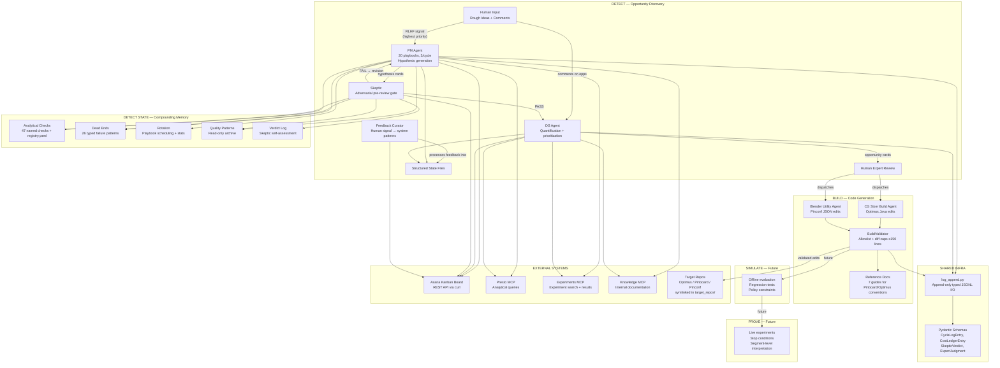
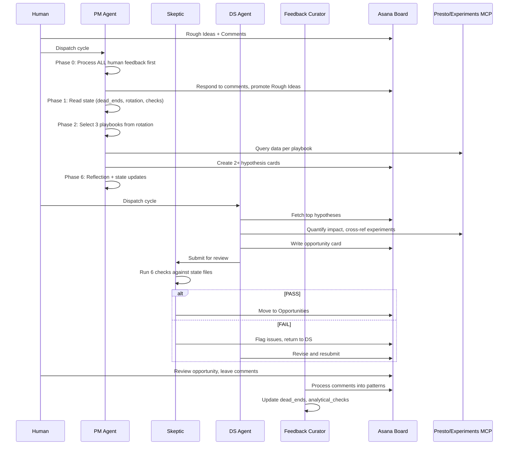
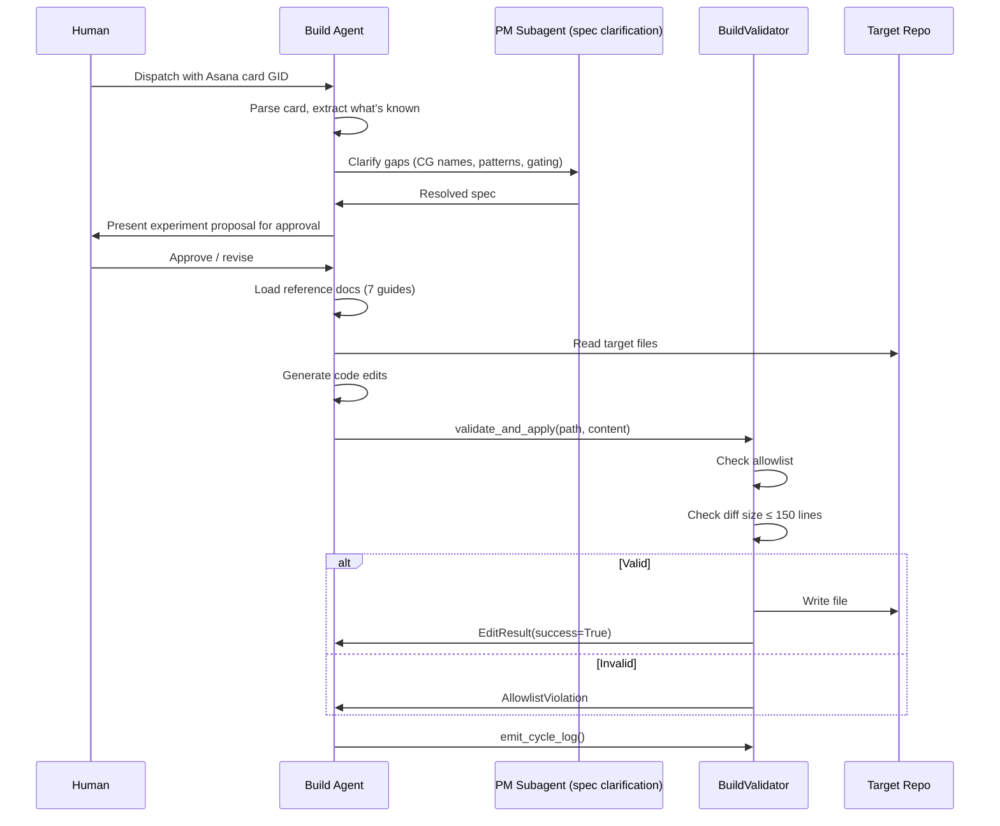

# Reflex Architecture

## Overview

Reflex is a self-healing discovery stack for Pinterest's Homefeed (and increasingly all discovery surfaces). It implements a four-stage pipeline — **Detect → Build → Simulate → Prove** — where AI agents continuously find opportunities, generate interventions, validate them offline, and prove them through live experiments. Humans shift from direct ML iteration to system supervision: defining "good," setting guardrails, and improving the meta-system.

Currently, **Detect is mature** (66+ cycles, 47 analytical checks, 20 active playbooks, ~116 cards on the board) and **Build is operational** (2 narrow agents with guardrails). Simulate and Prove are future stages not yet implemented.

The system is framed as a reinforcement learning loop — each cycle makes the system smarter via structured state compounding (quality patterns, dead ends, analytical checks, playbook evolution) — though the actual mechanism is prompt-level adaptation rather than gradient-based RL.

## System Diagram



## Directory Structure

```
reflex/
├── CLAUDE.md                        <- Project-level instructions (agent conventions, structure)
├── config.yaml                      <- Target repo paths, model defaults
├── pyproject.toml                   <- Python project (pydantic, pyyaml, pytest)
├── infra/                           <- Pipeline-level shared infrastructure
│   ├── __init__.py
│   ├── log_append.py                <- append_jsonl / read_jsonl / iter_jsonl
│   └── schemas/
│       ├── __init__.py
│       ├── cycle_log.py             <- CycleLogEntry (per-run telemetry)
│       └── cost_ledger.py           <- CostLedgerEntry (per-LLM-call cost tracking)
├── detect/                          <- Detect stage (most mature)
│   ├── CLAUDE.md                    <- Detect-specific instructions (playbooks, conventions)
│   ├── __init__.py
│   ├── agents/
│   │   ├── pm_agent.md              <- PM Agent prompt (hypothesis generation)
│   │   ├── ds_agent.md              <- DS Agent prompt (opportunity quantification)
│   │   ├── skeptic.md               <- Skeptic prompt (adversarial review)
│   │   └── feedback_curator.md      <- Feedback Curator prompt (human signal processing)
│   ├── playbooks/                   <- 20 active + 2 retired detection routines
│   │   ├── metric_anomaly.md
│   │   ├── relevance_gaps.md
│   │   ├── engagement_decomposition.md
│   │   ├── experiment_review.md
│   │   ├── experiment_doubledown.md
│   │   ├── ... (20 total)
│   │   └── harmful_business_rules.md
│   ├── capabilities/
│   │   └── analytical_checks/       <- 47 named checks (reusable analysis patterns)
│   │       ├── registry.yaml        <- Index: id, name, verdict, mandatory_when, applies_to
│   │       ├── vlm_verification.md
│   │       ├── topline_impact_sizing.md
│   │       ├── ... (47 total)
│   │       └── code_anchor.md
│   ├── state/                       <- Structured compounding memory
│   │   ├── dead_ends.yaml           <- 26 typed failure patterns (auto_fail / warn)
│   │   ├── rotation.yaml            <- Playbook scheduling, stats, next-up queue
│   │   ├── cycle_log.jsonl          <- Append-only run telemetry
│   │   ├── cost_ledger.jsonl        <- Append-only LLM cost records
│   │   └── verdict_log.jsonl        <- Skeptic verdicts (for self-calibration)
│   ├── infra/
│   │   ├── schemas/                 <- Detect-specific Pydantic models
│   │   │   ├── skeptic_verdict.py   <- SkepticVerdict, SkepticCheck
│   │   │   ├── expert_judgment.py   <- ExpertJudgment (human feedback schema)
│   │   │   ├── disagreement.py
│   │   │   └── pattern_provenance.py
│   │   └── experts.yaml             <- Expert roster for judgment attribution
│   ├── schemas/                     <- Card template docs
│   │   ├── hypothesis_card.md
│   │   └── opportunity_card.md
│   ├── quality_patterns.md          <- Read-only archive (cycle learnings, rankings)
│   ├── quality/                     <- Quality audit trail
│   │   ├── audit-logs/              <- Curator audit logs (date-stamped)
│   │   └── proposed/                <- Proposed quality improvements
│   ├── board_setup.md               <- Asana board config, section GIDs, API patterns
│   ├── queries/                     <- Discovered Presto tables + query templates
│   │   └── README.md
│   └── tests/
│       ├── __init__.py
│       └── test_schemas.py
├── build/                           <- Build stage (operational, narrow scope)
│   ├── __init__.py
│   ├── agents/
│   │   ├── cg_sizer_build_agent.md  <- CG Sizer prompt (Optimus Java)
│   │   └── blender_utility_agent.md <- Blender Utility prompt (Pinconf JSON)
│   ├── infra/
│   │   ├── __init__.py
│   │   ├── validator.py             <- BuildValidator class
│   │   └── allowlist.py             <- Allowlist + AllowlistViolation
│   ├── references/                  <- Context docs for Build agents
│   │   ├── cg_pipeline_overview.md
│   │   ├── cg_sizer_pattern.md
│   │   ├── pinboard_api_perf_and_tests.md
│   │   ├── pinboard_decider_conventions.md
│   │   ├── pinboard_layering.md
│   │   ├── pinboard_naming_and_constants.md
│   │   └── pinboard_observability.md
│   ├── state/
│   │   ├── allowlist.yaml           <- Approved paths + diff caps (150 lines max)
│   │   └── eval_reports/            <- Tier 2 eval results
│   └── tests/
│       ├── __init__.py
│       ├── test_build_validator.py
│       ├── test_sizer_tier1.py
│       ├── test_sizer_tier2.py
│       ├── eval_tier2_graphsage_to_plp.py
│       └── eval_tier2_shopping_holdout.py
├── docs/                            <- Vision & architecture documents
│   ├── reflex-vision-two-pager.md   <- Full vision doc (the "why")
│   ├── architecture.md              <- Existing arch doc (lighter than this one)
│   ├── Detect_spec.md               <- Original Detect spec
│   ├── cg_reference.md
│   ├── blender_reference.md
│   ├── blender_utility_reference.md
│   ├── full_funnel_reference.md
│   ├── anticipation-p13n-vision-2026.md
│   └── setup.md
├── scripts/                         <- Utility scripts
└── target_repos/                    <- Gitignored symlinks to local checkouts
    ├── optimus -> ~/code/optimus
    ├── pinboard -> ~/code/pinboard
    └── pinconf -> ~/code/pinconf
```

## Components

### Detect Stage — The Opportunity Engine

The most mature component. Runs a multi-agent discovery loop against Pinterest's real infrastructure — Presto analytics, experiments platform, internal knowledge base — and produces a prioritized Kanban backlog of improvement opportunities.

**Architecture pattern:** Supervisor topology (human dispatches, agents execute, human reviews). Agents communicate through shared state files and an Asana board. Each agent is a "prompt-as-code" markdown file — no Python orchestration, just Claude Code executing the prompt directly.

**Agents:**
| Agent | Role | Trigger | Output |
|-------|------|---------|--------|
| PM Agent | Hypothesis generation | Manual dispatch, 3 playbooks/cycle | Asana hypothesis cards |
| DS Agent | Opportunity quantification | Manual dispatch after PM | Asana opportunity cards |
| Skeptic | Adversarial review gate | After DS completes a card | SkepticVerdict (PASS/FAIL/NEEDS_HUMAN) |
| Feedback Curator | Human signal processing | After human comments | Updated state files |

**Execution flow (one cycle):**


**The compounding mechanism:** What makes Detect more than a report generator is its structured memory system. After each cycle:
- New analytical checks get codified (47 and growing)
- Dead ends get recorded (26 typed failure patterns)
- Playbook performance stats get updated (conversion rates, hypotheses generated)
- Quality patterns accumulate (presentation techniques, domain corrections)

This creates an effective "reward signal" without actual RL — each cycle starts at a higher quality floor because the state files encode accumulated learning.

### Build Stage — The Code Generator

Takes opportunity cards from the Detect board and generates validated code edits in target repositories. Currently scoped to two narrow domains.

**Agents:**
| Agent | Domain | Target Repo | Edit Scope |
|-------|--------|-------------|------------|
| CG Sizer Build Agent | Candidate generation sizer experiments | Optimus (Java) | SizerExperiments.java, HomefeedExperimentUtils.java, etc. |
| Blender Utility Agent | Blender utility weight experiments | Pinconf (JSON) | utility_config_exp/*.json |

**Guardrails (BuildValidator):**
- **Allowlist:** Only pre-approved file paths can be written (currently 10 specific files/patterns)
- **Diff caps:** Maximum 150 changed lines per file
- **Approval chain:** Each allowlist entry requires sign-off from team lead + Reflex owner
- **Dry-run mode:** Test edits without writing

**Build agent workflow:**


### Shared Infrastructure

Minimal, focused plumbing that both stages depend on. Neither stage depends on the other — they communicate through Asana cards and the shared state directory.

| Module | Purpose | Interface |
|--------|---------|-----------|
| `infra/log_append.py` | Typed append-only JSONL I/O | `append_jsonl(path, entry)`, `read_jsonl(path, model)`, `iter_jsonl(path, model)` |
| `infra/schemas/cycle_log.py` | Per-run telemetry | `CycleLogEntry(timestamp, agent, run_id, duration_s, inputs, outputs, errors)` |
| `infra/schemas/cost_ledger.py` | Per-LLM-call cost tracking | `CostLedgerEntry(timestamp, agent, model, operation, tokens, cost_usd)` |

### Detect Capabilities — The Analytical Checks Library

A growing library of 47 named, reusable analysis patterns. Each check is a `.md` file with:
- What it does
- When it's mandatory vs. high-value
- Which surfaces it applies to
- How to apply it
- When it was discovered (which cycle)

The `registry.yaml` serves as an index — agents query it by surface and verdict to find applicable checks. This is effectively a "skill library" for the agents — codified analytical knowledge that compounds across cycles.

**Check categories:** mandatory (10), high-value (37). Mandatory checks must be applied whenever their trigger condition is met (e.g., "VLM verification — ALWAYS, every pin example in every task").

### Detect State — The System's Memory

| File | Role | Write Pattern |
|------|------|---------------|
| `dead_ends.yaml` | Typed registry of known failures | Append when discovered |
| `rotation.yaml` | Playbook scheduling + performance stats | Updated every cycle |
| `cycle_log.jsonl` | Run telemetry (agent, duration, I/O) | Append per run |
| `cost_ledger.jsonl` | LLM cost records (tokens, model, USD) | Append per call |
| `verdict_log.jsonl` | Skeptic verdicts (for self-calibration) | Append per review |
| `quality_patterns.md` | Historical archive (read-only) | Rarely updated |

**Dead ends** deserve special attention. These are typed failure patterns (26 entries) with categories: `table_columns`, `table_joins`, `asana_api`, `mcp_usage`, `analytical_proxy`, `experiment_status`, `structural`. Each entry has an `id`, `pattern` (what people try), `why_it_fails`, `correct` (what to do instead), and `severity` (auto_fail / warn). This is the system's "negative knowledge" — things it has learned not to do.

## Key Files

| File | Role |
|------|------|
| `CLAUDE.md` | Top-level project instructions — agent conventions, structure, metrics language |
| `detect/CLAUDE.md` | Detect-specific instructions — playbook inventory, tool usage, board conventions |
| `detect/agents/pm_agent.md` | The most complex agent prompt (~400 lines). Defines the full PM Agent execution flow: feedback processing, state loading, playbook execution, hypothesis generation, reflection |
| `detect/agents/skeptic.md` | Adversarial review logic — 6 checks, flag taxonomy (HIGH/MED/LOW), self-calibration via verdict_log |
| `detect/capabilities/analytical_checks/registry.yaml` | The "skill index" — all 47 checks with trigger conditions and surface applicability |
| `detect/state/dead_ends.yaml` | Negative knowledge — 26 typed failure patterns with severity and corrections |
| `detect/state/rotation.yaml` | Playbook scheduler — rotation pointer, per-playbook conversion rates, next-up queue |
| `build/infra/validator.py` | BuildValidator — the safety layer. Allowlist + diff caps + cycle logging |
| `build/infra/allowlist.py` | Allowlist enforcement — fnmatch-based path validation with per-team approval |
| `build/state/allowlist.yaml` | The actual approved paths (10 files/patterns, max 150 diff lines) |
| `infra/log_append.py` | The only shared runtime code — 33 lines of typed JSONL I/O |
| `docs/reflex-vision-two-pager.md` | The "why" — vision, examples, update on Detect POC results |
| `config.yaml` | Minimal config — target repo paths, model defaults |

## Data Flow

### Detect Cycle (behavioral trace)

1. **Human dispatch** → James invokes PM Agent in Claude Code from `reflex/detect/`
2. **Phase 0** → Agent reads Rough Ideas + unresponded comments (Asana REST API via curl)
3. **Phase 0b** → Agent loads state: `dead_ends.yaml`, `rotation.yaml`, `analytical_checks/registry.yaml`, `quality_patterns.md`
4. **Phase 1** → Agent selects 3 playbooks from `rotation.yaml` (next-up queue)
5. **Phase 2-4** → For each playbook: query Presto MCP, apply analytical checks, generate hypothesis cards
6. **Phase 5** → Post cards to Asana (Hypotheses section), tag surfaces + workstreams
7. **Phase 6** → Reflection: update `rotation.yaml` pointer + stats, note what worked

Then DS Agent runs similarly, maturing hypotheses → opportunities. Skeptic gates before human review.

### Build Cycle (behavioral trace)

1. **Human dispatch** → James invokes CG Sizer Build Agent with an Asana card GID
2. **Step 1** → Agent fetches card content + comments from Asana
3. **Step 2** → Spawns PM subagent to clarify ambiguous spec fields
4. **Step 3** → Presents concrete proposal (which CGs, which budget direction, which gating)
5. **Step 4** → Human approves
6. **Step 5** → Agent loads `build/references/` docs, reads target files from `target_repos/optimus`
7. **Step 6** → Generates code edits (Java experiment constants, sizer values, gating logic)
8. **Step 7** → Calls `BuildValidator.validate_and_apply()` — allowlist check, diff size check, write
9. **Step 8** → Emits cycle_log entry

## Observations

⭐ **The compounding memory system is the core architectural innovation.** The combination of `dead_ends.yaml`, `analytical_checks/registry.yaml`, `rotation.yaml` stats, and `quality_patterns.md` creates a hand-crafted reward signal that approximates RL without gradient updates. Over 66+ cycles, this has produced visible quality improvement — early cards were "directional sketches," current cards carry "VLM-verified pin stories, triple-dimensional decompositions, SSv2 bridging estimates."

⭐ **Agents as prompt-files is the right abstraction for now.** Each agent is a self-contained `.md` file that Claude Code executes directly. No Python orchestration overhead, no framework dependencies, no abstraction layers between the LLM and the task. This keeps iteration speed high and complexity low.

⭐ **The Skeptic agent implements the "Reflection" design pattern** from the agentic systems literature — adversarial self-evaluation between generation and human review. The self-calibration loop (reading verdict_log to assess its own precision) is a lightweight but effective form of the process-wise reward signal described in the agentic RL references.

⭐ **BuildValidator's allowlist is a well-designed safety layer.** Blast radius is contractually limited: specific files, specific teams, specific approval chains, hard diff caps. This is what makes autonomous code generation safe enough to use.

🔀 **The Detect → Build handoff is the key decision gate.** Currently manual — a human reads the opportunity card, decides it's ready, and dispatches a Build agent. This is where automation would have the highest leverage (confidence-threshold-based auto-dispatch), but also where the risk of bad interventions is highest.

⚠️ **No orchestration layer.** Agents are manually triggered one at a time. There's no scheduler, no dependency tracking between runs, no automatic sequencing (PM → Skeptic → DS). This limits throughput to "however often James remembers to run them" and prevents 24/7 operation.

⚠️ **Build stage is dramatically narrower than Detect.** 47 analytical checks and 20 playbooks feed into just 2 Build agents that can only touch 10 specific files. The pipeline narrows from "discover any opportunity across all surfaces" to "edit CG sizer values or blender utility weights." Most opportunities generated by Detect have no Build agent capable of acting on them.

⚠️ **No Simulate stage creates a validation gap.** Build generates code edits, but there's no offline evaluation step before human review. The BuildValidator checks structural constraints (allowlist, diff size) but not semantic correctness (will this change actually improve the metric?). The reference material on agentic RL emphasizes that offline simulation is critical as volume scales — you can't A/B test every idea.

⚠️ **State compounding is fragile to format drift.** The structured state files (YAML, JSONL) are maintained by agent prompts that interpret and update them. There's no schema migration, no validation on write (beyond Pydantic for JSONL entries), and `quality_patterns.md` is a large unstructured document that could drift. A schema violation in `dead_ends.yaml` or `rotation.yaml` would silently corrupt the agents' memory.

⚠️ **Cost tracking exists but isn't used for budget management.** `CostLedgerEntry` logs every LLM call but there's no budget cap, no cost-per-cycle alert, no mechanism to choose cheaper models for routine tasks. The `cost-aware-llm-pipeline` reference patterns (model routing by complexity, budget tracking) aren't implemented.

📝 **The "RL" framing vs. actual mechanism.** CLAUDE.md says "Reflex is a reinforcement learning system" and the reference material covers PPO, GRPO, reward design, curriculum learning. But the actual implementation is prompt-level adaptation with structured state files — more like "few-shot learning with a growing example bank" than RL. The gap between aspiration (agentic RL) and current mechanism (structured prompt compounding) is significant. The reference material suggests specific next steps: reward modeling for card quality, offline policy evaluation via replay, curriculum design for Build agent expansion.

📝 **Multi-agent topology is "human as supervisor."** The reference material on single-agent vs. multi-agent systems discusses when each is appropriate. Reflex's current topology (human dispatches, agents execute independently, human reviews) is a supervisor pattern where the human IS the supervisor. The reference material suggests this is appropriate when "tasks require global coherence" and the "coordination cost" of fully autonomous multi-agent is high. Moving toward autonomous operation would require either a single-agent orchestrator or explicit inter-agent communication protocols.

📝 **Playbook evolution is the PM Agent's meta-learning.** Every 6th cycle (~full rotation), the PM Agent audits all 20 playbooks, evaluates performance, and can draft new ones or retire stale ones. This is a form of curriculum design — the system decides what to practice based on what's working. The rotation stats in `rotation.yaml` (conversion rates: `market_cg_performance` at 100%, `supply_gaps` at 8%) provide signal for this allocation.

📝 **The dead_ends registry is a negative reward cache.** In RL terms, these are state-action pairs with known negative reward that get filtered from the action space before the agent even considers them. The `auto_fail` severity means "never try this" — equivalent to removing an action from the MDP. The `warn` severity is a penalty signal rather than a hard constraint.
