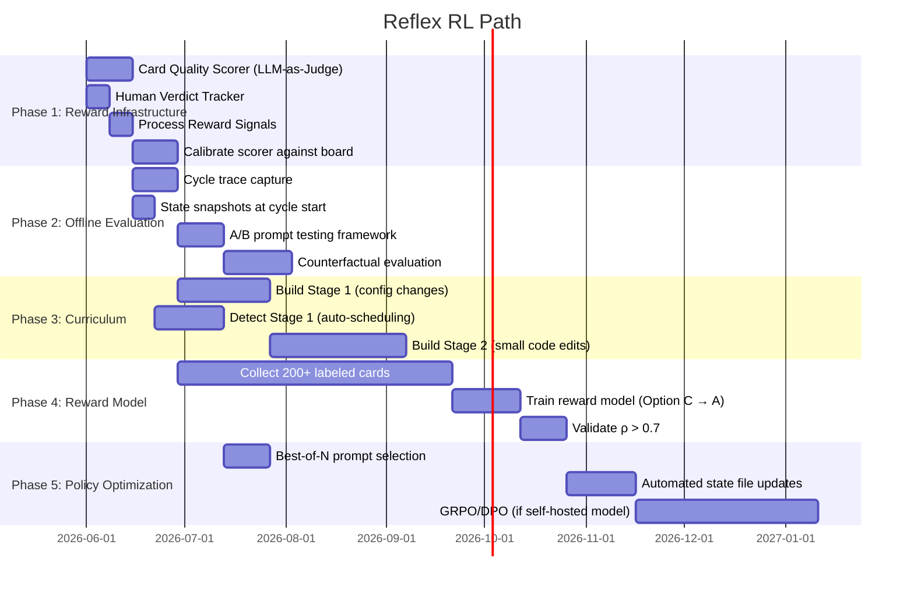

# Reflex RL Path — From Structured Compounding to Actual Reinforcement Learning

## The Gap

Reflex's CLAUDE.md says "Reflex is a reinforcement learning system." This is aspirationally true — each cycle makes the system smarter via structured state compounding — but the current mechanism is **prompt-level adaptation with hand-crafted state files**, not gradient-based RL.

The current system:
- **Reward signal:** Human comments on Asana cards (sparse, delayed, unstructured)
- **Policy:** Agent prompts (.md files) that reference structured state
- **Value function:** None
- **State:** dead_ends.yaml, analytical_checks/registry.yaml, rotation.yaml, quality_patterns.md
- **Action space:** Tool calls (Presto MCP, Experiments MCP, Knowledge MCP, Asana API) + text generation (cards)
- **Update mechanism:** Manual prompt editing + structured state file updates

The gap to actual RL:
- No formalized reward function
- No offline policy evaluation
- No systematic comparison of agent behaviors
- No curriculum for capability expansion
- No automated quality scoring of outputs
- No mechanism to test "would this prompt change make things better?"

## Constraints

Reflex uses Claude via Claude Code. We do **not** fine-tune the underlying LLM. This means:

1. **No gradient-based policy updates** on the primary agent. Claude's weights are fixed.
2. **RL applies at the meta-level** — optimizing prompts, state files, playbook selection, and tool-use strategies rather than model parameters.
3. **Reward models can be trained separately** — a smaller model (or Claude-as-Judge) that evaluates agent output quality.
4. **Offline evaluation is feasible** — replay past cycles with different prompts/configs and compare outcomes.
5. **The "policy" is the prompt + state files** — changes to these are the "parameter updates."

This makes Reflex more like a **contextual bandit with LLM-as-policy** than classic deep RL. The action space is structured (tool calls + text), the reward is delayed (human review days later), and the policy is a prompt that conditions on accumulated state.

## The RL Formulation for Reflex

### MDP Definition

| Component | Reflex Mapping |
|-----------|---------------|
| **State (s_t)** | Current board state + structured memory (dead_ends, checks, rotation) + the specific playbook/task being worked on + conversation history with MCP tools |
| **Action (a_t)** | Either `CALL(tool, args)` (query Presto, search experiments, write Asana card) or `ANSWER(card_content)` (emit final hypothesis/opportunity card) |
| **Transition (T)** | Tool call → tool returns result → new state with appended context. Card emission → episode terminates. |
| **Reward (R)** | Decomposed into process rewards (per-step) + outcome reward (final card quality) |
| **Episode** | One agent cycle: human dispatch → state loading → playbook execution → card output → human review |
| **Discount (γ)** | ~0.95 (later steps matter slightly less; early tool choices compound) |

### Decomposed Reward Function

Following the agentic_rl.md "When/Which/How" framework, adapted for Reflex:

```
R_cycle = R_process + R_outcome

R_process = w_tool·r^tool_selection + w_query·r^query_quality + w_check·r^check_compliance + w_state·r^state_usage

R_outcome = w_card·r^card_quality + w_novel·r^novelty + w_impact·r^impact_sizing + w_human·r^human_verdict
```

**Process Rewards (dense, per-step):**

| Signal | How to Measure | Weight |
|--------|---------------|--------|
| `r^tool_selection` | Did the agent choose the right MCP tool for the analytical question? | 0.5-1.0 |
| `r^query_quality` | Did the Presto query execute successfully? Return meaningful results? Avoid dead-end patterns? | 0.5-1.5 |
| `r^check_compliance` | Did the agent apply mandatory analytical checks from registry.yaml? | 1.0-2.0 |
| `r^state_usage` | Did the agent consult dead_ends before querying? Avoid known failure patterns? | 1.0 |

**Outcome Rewards (sparse, per-cycle):**

| Signal | How to Measure | Weight |
|--------|---------------|--------|
| `r^card_quality` | LLM-as-Judge scoring on structure, evidence, specificity (1-5 scale) | 3.0-5.0 |
| `r^novelty` | Is this genuinely new vs. duplicate of existing board content? | 2.0-3.0 |
| `r^impact_sizing` | Does the card bridge to SSv2/DAU with a credible estimate? | 2.0-3.0 |
| `r^human_verdict` | Human reviewer response: promoted (+8), kept (+3), revised (+1), archived (-2), dead-end (-5) | 5.0-15.0 |

**Asymmetric weighting:** Outcome rewards (especially `r^human_verdict`) dominate so the system optimizes for real quality, not just process compliance. Process rewards scaffold early learning but don't let the agent "game" high scores by calling tools correctly but producing weak cards.

### The "Policy" is the Prompt + State

Since we can't update Claude's weights, the "policy parameters" we optimize are:

1. **Agent prompts** (.md files) — wording, structure, emphasis, examples
2. **Playbook content** — what each playbook instructs the agent to do
3. **State files** — what's in dead_ends, which checks are mandatory vs. high-value
4. **Rotation strategy** — which playbooks get run, in what order, how often
5. **Quality patterns** — what "good" looks like (examples, anti-patterns)

An "RL update" in this system = **a change to any of the above, informed by reward signals and evaluated via offline replay.**

## What We Need to Build

### Phase 1: Reward Infrastructure (the "critic")

**Goal:** Formalize what "good" means so we can measure it automatically.

**Components to build:**

1. **Card Quality Scorer (LLM-as-Judge)**
   - A Claude prompt that scores cards on 5 dimensions (1-5 each):
     - Evidence quality (data-backed? queries cited? VLM-verified?)
     - Specificity (actionable? names CGs/segments/metrics? or vague?)
     - Novelty (new insight? or restatement of known fact?)
     - Impact sizing (bridged to SSv2/DAU? credible estimate?)
     - Structural completeness (follows schema? all required sections?)
   - Input: card HTML content + context (board state, existing cards)
   - Output: structured score + rationale
   - **Calibration:** Score the existing 116 cards on the board. Rank them. Compare to James's subjective ranking. Iterate prompt until correlation is high.
   - **Cost:** ~$0.05/card at Sonnet, ~$0.25/card at Opus. Cheap enough to run on every card every cycle.

2. **Human Verdict Tracker**
   - Map Asana board movements to reward signals:
     - Card moved Hypotheses → Opportunities = DS Agent promoted (+3)
     - Card moved to Archive = dead end (-5)
     - Card gets human comment with "great" / "ship this" = strong positive (+8)
     - Card gets human comment with correction = revision needed (+1)
     - Card unchanged for 3+ cycles = stale (0, but flag for review)
   - Store as structured JSONL alongside cost_ledger: `reward_log.jsonl`
   - Schema: `RewardEntry(card_gid, cycle_id, reward_type, value, source)`

3. **Process Reward Signals (automated)**
   - **Query success rate:** Did Presto queries execute? (from cycle_log errors field)
   - **Dead-end avoidance:** Did the agent avoid patterns in dead_ends.yaml? (check query text against known failures)
   - **Check compliance:** Did mandatory checks get applied? (compare card content against registry.yaml mandatory checks for the tagged surface)
   - **Skeptic pass rate:** What fraction of cards pass Skeptic on first submission?

**Output of Phase 1:** A `reward_log.jsonl` that accumulates per-card, per-cycle reward signals. This is the "critic" — it tells us how good each agent output was.

### Phase 2: Offline Policy Evaluation (the "simulator")

**Goal:** Answer "would this change to the prompt/config make things better?" without running live cycles.

**Components to build:**

1. **Cycle Replay Infrastructure**
   - Capture full agent traces: every tool call, every MCP response, every intermediate reasoning step
   - Store as structured episodes: `Episode(cycle_id, agent, state_at_start, actions[], tool_responses[], final_output, reward)`
   - This is the "offline dataset" for policy evaluation

2. **Counterfactual Evaluation (Doubly Robust method)**
   - Given: logged episode under current policy (prompt A)
   - Question: What would happen under new policy (prompt B)?
   - Method:
     1. **Direct Model:** Train card quality predictor from (state, action) → reward using historical data
     2. **Importance Sampling:** Weight by P(action|prompt_B) / P(action|prompt_A) — approximated by having Claude score "how likely would prompt B produce this action?"
     3. **Doubly Robust:** Combine both for lower-variance estimates
   - **Practical implementation:** Run the new prompt against the same input state (board snapshot + playbook) and score the output with Card Quality Scorer. Compare to historical output. This is cheaper than full IS.

3. **A/B Prompt Testing**
   - Simpler than full OPE: run the same cycle inputs through two different prompts, score both outputs, compare.
   - Requires: snapshots of board state at cycle start (already partially in cycle_log)
   - Add: full state snapshots (dead_ends + rotation + board content) at cycle start → `state_snapshots/cycle_{N}.json`

**Output of Phase 2:** The ability to say "prompt change X would improve card quality by Y points" before deploying it. This is the offline evaluation loop.

### Phase 3: Curriculum Design (expanding what agents can do)

**Goal:** Systematically expand Build agent coverage (currently 2 agents, 10 files) without catastrophic failures.

**Curriculum stages for Build expansion:**

| Stage | Capability | Guardrail | Success Metric |
|-------|-----------|-----------|----------------|
| 0 (current) | CG sizer values, blender utility weights | Allowlist + 150-line diff cap | Human approval rate |
| 1 | Config-level changes (experiment params, feature flags) | Allowlist + diff cap + dry-run validation | Tier 1 tests pass |
| 2 | Small code edits (add new experiment group, wire existing feature) | Allowlist + diff cap + Tier 2 eval | Tier 2 eval pass + human review |
| 3 | Moderate code edits (new retrieval source, new ranking feature) | Expanded allowlist + architectural review gate | Integration test pass + peer review |
| 4 | Cross-file changes (feature spanning multiple files) | Full PR review process | CI pass + team lead approval |
| 5 | Novel interventions (new approach not matching existing patterns) | Simulation stage required | Offline eval positive + human design review |

**Curriculum scheduling:**
- Each stage unlocks only after the previous stage achieves >90% human approval rate over 10+ cycles
- New stages start in dry-run mode (generate edits, validate, but don't write)
- Allowlist expansion requires explicit sign-off (already in the system)

**Curriculum for Detect agent expansion:**

| Stage | Capability | Current Status |
|-------|-----------|----------------|
| 0 (current) | 20 playbooks, 3/cycle, manual dispatch | Mature (66+ cycles) |
| 1 | Automated cycle scheduling (no human dispatch needed) | Not built |
| 2 | Adaptive playbook selection (not just rotation — pick based on board gaps) | Partially in rotation.yaml stats |
| 3 | Cross-agent coordination (PM → Skeptic → DS as automated pipeline) | Not built |
| 4 | Self-generated playbooks (agent proposes new playbooks from patterns) | Partially in Phase 6b |
| 5 | Autonomous board management (agent decides when to archive, when to escalate) | Not built |

### Phase 4: Reward Model Training (the "learned critic")

**Goal:** Move from rule-based + LLM-as-Judge rewards to a trained reward model.

**Why:** LLM-as-Judge (Phase 1) is expensive per-card and may not capture James's actual preferences. A trained reward model learns from James's revealed preferences (which cards he promotes, comments on, ignores, archives).

**Components:**

1. **Training data:** All cards ever produced + their outcomes (promoted/archived/revised/ignored) + human comments + Card Quality Scorer outputs. This is ~116 cards with implicit labels from board movements.

2. **Reward model architecture options:**
   - **Option A: Fine-tuned classifier** — Train a small model (e.g., Haiku-class) to predict card quality score from card text. Cheap to run, fast inference.
   - **Option B: Learned preference model** — DPO-style: given two cards, which is better? Train from pairwise comparisons derived from board position (higher-ranked card > lower-ranked).
   - **Option C: Continue with LLM-as-Judge** but calibrate the prompt using human verdict data. Cheapest to implement, iterates via prompt tuning.

   **Recommended:** Start with Option C (calibrated judge), move to Option A when you have 200+ labeled cards.

3. **Validation:** Measure rank correlation between reward model scores and actual human outcomes. Target: Spearman ρ > 0.7 before using for policy decisions.

### Phase 5: Policy Optimization (the "RL loop")

**Goal:** Close the loop — use reward signals to automatically improve agent prompts and configs.

**This is the furthest-out phase and the most speculative.** Options:

1. **Prompt optimization via best-of-N sampling:**
   - Generate N candidate prompt variations
   - Run each against offline evaluation (Phase 2)
   - Keep the highest-scoring prompt
   - This is "rejection sampling" — the simplest form of RL
   - **Practical:** Generate 3-5 prompt variants per cycle, evaluate offline, deploy the winner

2. **Structured state optimization:**
   - Use reward signals to automatically update state files:
     - Low `r^query_quality` on a specific table → auto-add to dead_ends.yaml
     - High `r^card_quality` when a specific check is applied → increase check weight in registry
     - Low conversion rate for a playbook → auto-deprioritize in rotation
   - This is already partially happening (agents update state files during reflection). Formalize it.

3. **GRPO for prompt selection (advanced, future):**
   - Group Relative Policy Optimization — sample K prompt completions, rank by reward, update toward high-reward completions
   - Would require a fine-tunable model for the agent (not Claude directly)
   - **Only viable if:** we move to a self-hosted model for specific subtasks (e.g., card quality scoring, playbook selection)
   - Reference: GRPO avoids the critic network entirely by using group-relative advantages — well-suited for Reflex where we can generate multiple completions cheaply

4. **DPO for preference learning (advanced, future):**
   - Direct Preference Optimization — learn from pairwise comparisons without explicit reward
   - Train on: (card_A, card_B, human_prefers_A) triples
   - Would produce a fine-tuned model that generates better cards directly
   - **Only viable if:** we move to a fine-tunable model

## Implementation Roadmap



## Key Architectural Decisions

### Decision 1: Single-Agent vs. Multi-Agent for RL

**Recommendation: Keep multi-agent for execution, single "evaluator" for RL.**

The current multi-agent topology (PM, DS, Skeptic, Feedback Curator) is correct for *execution* — each agent has a specialized role with different tool needs and different outputs.

But the *RL system* (reward model, policy evaluation, optimization) should be a **single orchestrating layer** that:
- Observes all agents' behaviors
- Scores all outputs uniformly
- Computes rewards across the full pipeline
- Proposes prompt/config changes to any agent

This avoids the coordination overhead of per-agent reward models while maintaining the benefits of specialized execution agents.

### Decision 2: Where Does Learning Happen?

| Layer | What Changes | Update Mechanism | Frequency |
|-------|-------------|------------------|-----------|
| State files (dead_ends, checks) | Negative knowledge, analytical patterns | Agent reflection + automated signals | Every cycle |
| Rotation strategy | Which playbooks run, how often | Conversion rate stats + reward model | Every full rotation (~7 cycles) |
| Agent prompts | Wording, emphasis, examples, structure | Offline A/B evaluation + best-of-N | Monthly (or when reward drops) |
| Playbook content | What each playbook instructs | Agent self-evolution (Phase 6b) + reward signal | Every 6th cycle |
| Allowlist / guardrails | What Build agents can touch | Human approval after curriculum milestone | Quarterly |

### Decision 3: What's the "Episode" Boundary?

**One episode = one agent cycle** (e.g., one PM Agent run producing 2-5 hypothesis cards).

Not one card, not one tool call, not one full Detect→Build pipeline.

Rationale:
- Cards within a cycle share context (same playbooks, same state)
- Tool calls within a card are intermediate steps, not independent decisions
- The Detect→Build pipeline crosses agent boundaries (different policies)

### Decision 4: When to Escalate from Prompt RL to Model RL?

**Escalation trigger:** When offline evaluation shows that the best prompt variant scores within 5% of the worst prompt variant on card quality — meaning prompt-level optimization has saturated.

At that point, consider:
- Fine-tuning a smaller model for specific subtasks (card scoring, playbook selection, query generation)
- Using GRPO/DPO on the fine-tuned model
- Keeping Claude for high-level reasoning but routing routine decisions to the trained model

**Current estimate:** This is 6-12 months out, after Phase 1-3 are mature and we have 500+ labeled episodes.

## Immediate Next Steps (Phase 1 Starter)

1. **Build the Card Quality Scorer prompt.** Score all 116 existing cards. Share rankings with James for calibration.
2. **Add `reward_log.jsonl` to the infra schemas.** Schema: `RewardEntry(timestamp, card_gid, cycle_id, reward_type, value, source, scorer_version)`.
3. **Instrument cycle_log with full trace data.** Add: queries executed, checks applied, playbooks run, cards produced. Currently only logs summary metrics.
4. **Start capturing board state snapshots.** At cycle start, dump: all card GIDs + sections + tags + last-modified. Store in `state_snapshots/`.
5. **Define the Skeptic pass rate as a leading indicator.** Track: first-submission pass rate over time. If it's improving, the system is learning. If flat, the reward signal isn't reaching the agents.
