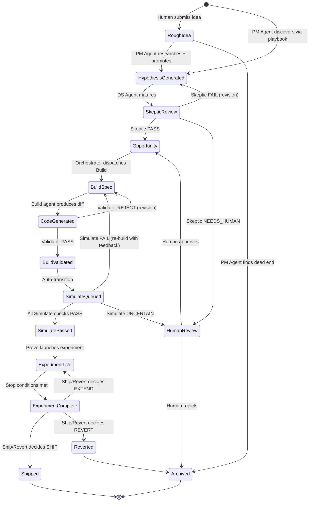
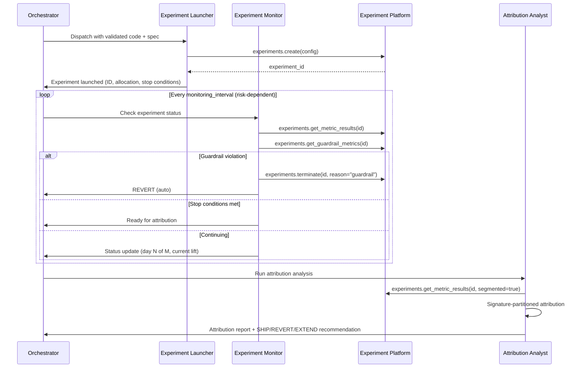
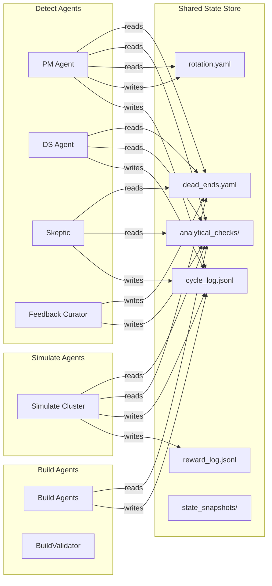
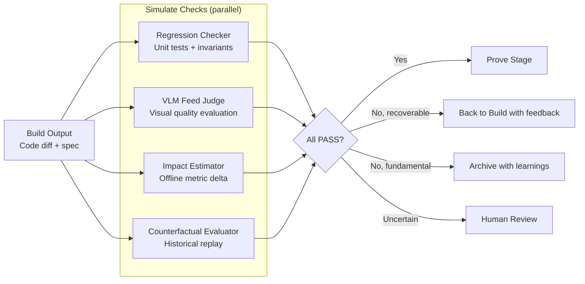
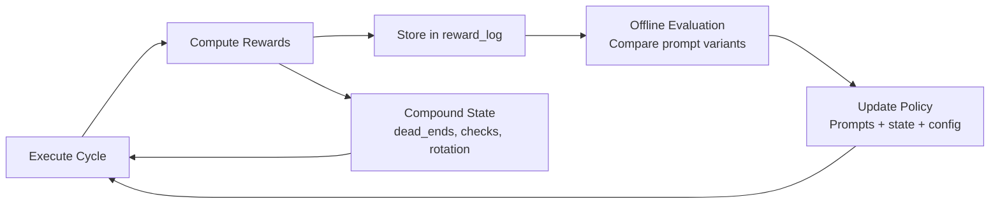

# Reflex System Design — Full Vision

**Status:** Clean-slate system design. Assumes no constraints on infrastructure, team size, or tooling. Designed to be built incrementally but specced as the complete end-state.

**Scope:** The complete Reflex system — Detect → Build → Simulate → Prove — operating autonomously across all Pinterest discovery surfaces, with agent-to-agent interfaces to Pinkerton (sensor substrate), Analytics Agent (data querying), and the broader Pinterest agent ecosystem.

---

## 1. System Overview

Reflex is a **self-healing discovery stack** — an autonomous loop that continuously detects where Pinterest's discovery experience is failing, builds interventions, validates them offline, and proves them through live experiments. Humans operate at the invariant-design and exception-handling layer, not the execution layer.

**Design philosophy:** Dark factory. The system runs lights-out. Humans define "good," set guardrails, handle exceptions, and improve the meta-system. The loop runs everything else.

```
┌──────────────────────────────────────────────────────────────────────┐
│                        REFLEX CONTROL PLANE                            │
│                                                                        │
│  ┌──────────┐   ┌──────────┐   ┌──────────┐   ┌──────────┐          │
│  │  DETECT  │──►│  BUILD   │──►│ SIMULATE │──►│  PROVE   │          │
│  │          │   │          │   │          │   │          │          │
│  │ Find     │   │ Generate │   │ Validate │   │ Run live │          │
│  │ what's   │   │ the fix  │   │ offline  │   │ + close  │          │
│  │ broken   │   │          │   │          │   │ the loop │          │
│  └────┬─────┘   └────┬─────┘   └────┬─────┘   └────┬─────┘          │
│       │              │              │              │                 │
│       ▼              ▼              ▼              ▼                 │
│  ┌──────────────────────────────────────────────────────────────┐   │
│  │              ORCHESTRATOR + STATE MANAGER                      │   │
│  │   Scheduling · Routing · Safety gates · State transitions     │   │
│  └──────────────────────────────────────────────────────────────┘   │
│       │              │              │              │                 │
└───────┼──────────────┼──────────────┼──────────────┼─────────────────┘
        │              │              │              │
        ▼              ▼              ▼              ▼
┌──────────────────────────────────────────────────────────────────────┐
│                     SUBSTRATE + SERVICES LAYER                         │
│                                                                        │
│  ┌────────────┐  ┌──────────────┐  ┌────────────┐  ┌──────────────┐│
│  │ PINKERTON  │  │  ANALYTICS   │  │  TARGET    │  │ EXPERIMENT   ││
│  │ Sensors    │  │  AGENT       │  │  REPOS     │  │ PLATFORM     ││
│  │ (MCP)      │  │  (MCP)       │  │  (Git)     │  │ (MCP)        ││
│  └────────────┘  └──────────────┘  └────────────┘  └──────────────┘│
│                                                                        │
│  ┌────────────┐  ┌──────────────┐  ┌────────────┐  ┌──────────────┐│
│  │ KNOWLEDGE  │  │   ASANA      │  │  REWARD    │  │  HUMAN       ││
│  │ (MCP)      │  │   (REST)     │  │  MODEL     │  │  INTERFACE   ││
│  └────────────┘  └──────────────┘  └────────────┘  └──────────────┘│
└──────────────────────────────────────────────────────────────────────┘
```

---

## 2. Agent Topology

### 2.1 Design Decision: Hierarchical Supervisor with Specialized Workers

The reference material on single-agent vs. multi-agent systems provides clear guidance:

- **Single-agent dominates** when tasks require global coherence, compute budgets are fixed, and base models are strong.
- **Multi-agent becomes competitive** when context degrades (too much data for one window), parallel search is needed, and verification requires independent evaluation.

Reflex hits the multi-agent triggers:
- Detect alone requires 20 playbooks × multiple MCP tools × board state — context exceeds useful window
- Build requires different domain expertise (Java/Optimus vs. Python/Pinboard vs. JSON/Pinconf)
- Simulate requires adversarial independence from Build (can't rubber-stamp its own work)
- Prove requires long-horizon monitoring (days/weeks) with periodic check-ins

**Chosen topology: Hierarchical Supervisor**

```
                    ┌───────────────┐
                    │  ORCHESTRATOR │  (Supervisor)
                    │  (scheduler,  │
                    │   router,     │
                    │   state mgr)  │
                    └───────┬───────┘
                            │
            ┌───────────────┼───────────────────┐
            │               │                   │
     ┌──────┴─────┐  ┌─────┴──────┐  ┌────────┴────────┐
     │  DETECT    │  │   BUILD    │  │ SIMULATE + PROVE │
     │  CLUSTER   │  │   CLUSTER  │  │    CLUSTER       │
     └──────┬─────┘  └─────┬──────┘  └────────┬────────┘
            │               │                   │
    ┌───┬───┼───┐     ┌────┼────┐        ┌────┼────┐
    │   │   │   │     │    │    │        │    │    │
   PM  DS  SK  FC   Sizer Blender      VLM  Exp   Attr
                     ...N more...      Judge Mgr  Analyst
```

**Why hierarchical (not flat network):**
- **Routing is deterministic.** Opportunities always flow Detect → Build → Simulate → Prove. No need for agents to discover each other.
- **State transitions are well-defined.** An opportunity card has a known lifecycle. The orchestrator enforces it.
- **Safety gates live between stages.** Skeptic gates Detect→Build. Simulate gates Build→Prove. Easier to enforce in a hierarchy.
- **Each cluster is internally specialized** but externally presents a single interface to the orchestrator.

### 2.2 Agent Inventory (Full Vision)

#### Detect Cluster

| Agent | Responsibility | Inputs | Outputs | External Dependencies |
|-------|---------------|--------|---------|----------------------|
| **PM Agent** | Hypothesis generation via playbook execution | Board state, playbooks, state files, MCP tool results | Hypothesis cards | Presto MCP, Experiments MCP, Knowledge MCP, Pinkerton MCP |
| **DS Agent** | Hypothesis → opportunity maturation | Hypothesis cards, board state | Opportunity cards | Presto MCP, Experiments MCP, Pinkerton MCP |
| **Skeptic** | Adversarial pre-review gate | Opportunity cards, state files | Verdict (PASS/FAIL/NEEDS_HUMAN) | None (in-process reasoning only) |
| **Feedback Curator** | Human signal → system patterns | Human comments, Asana activity | State file updates | Asana REST |
| **Playbook Evolver** | Meta-learning: evolve playbook library | Rotation stats, reward signals | New/updated/retired playbooks | None |

#### Build Cluster

| Agent | Responsibility | Inputs | Outputs | External Dependencies |
|-------|---------------|--------|---------|----------------------|
| **Spec Clarifier** | Opportunity card → unambiguous build spec | Opportunity card, codebase context | Structured spec | Knowledge MCP, target repos |
| **Code Generator** | Spec → validated code edits | Spec, reference docs, target files | Code diffs | Target repos (Git) |
| **Build Validator** | Safety enforcement (allowlist, diff caps) | Code diffs | PASS/REJECT | None (in-process) |
| **Test Generator** | Auto-generate test cases for edits | Code diffs, test conventions | Test files | Target repos (Git) |

Build agents are **domain-specialized by target repo + change type:**
- CG Sizer Agent (Optimus/Java — sizer experiments)
- Blender Utility Agent (Pinconf/JSON — utility weights)
- Ranking Feature Agent (Pinboard/Python — ranking model features)
- Retrieval Config Agent (Optimus/Java — retrieval source configs)
- ... (expands via curriculum, see §7)

#### Simulate Cluster

| Agent | Responsibility | Inputs | Outputs | External Dependencies |
|-------|---------------|--------|---------|----------------------|
| **VLM Feed Judge** | Visual quality evaluation of proposed changes | Code diff + simulated feed output | Quality verdict + score | Pinkerton MCP (signature evaluation) |
| **Regression Checker** | Verify no regression on known invariants | Code diff + invariant set | PASS/FAIL per invariant | Target repo test suite |
| **Impact Estimator** | Offline impact estimation | Code diff + historical data | Estimated metric delta | Analytics Agent, Presto MCP |
| **Counterfactual Evaluator** | "What would this change have done last week?" | Code diff + historical traffic logs | Counterfactual impact | Analytics Agent |

#### Prove Cluster

| Agent | Responsibility | Inputs | Outputs | External Dependencies |
|-------|---------------|--------|---------|----------------------|
| **Experiment Launcher** | Create + configure live experiment | Validated code + experiment spec | Running experiment | Experiment Platform API |
| **Experiment Monitor** | Ongoing metric monitoring during experiment | Experiment ID + stop conditions | Status updates + alerts | Experiment Platform, Presto MCP |
| **Attribution Analyst** | Post-experiment causal attribution | Experiment results + Pinkerton signatures | Segment-level attribution report | Analytics Agent, Pinkerton MCP |
| **Ship/Revert Decider** | Final decision with evidence | Attribution report + stop conditions | SHIP/REVERT/EXTEND recommendation | None (in-process reasoning) |

---

## 3. Orchestrator Design

The orchestrator is the system's brain — it schedules, routes, enforces safety, and manages state transitions. It is NOT an LLM agent. It is a **deterministic Python service** with well-defined rules.

### 3.1 Responsibilities

| Responsibility | Implementation |
|---------------|----------------|
| **Scheduling** | Cron-based cycle triggers (configurable: hourly, daily, per-stage) |
| **Routing** | Deterministic state machine: opportunity cards flow through stages based on their status |
| **Safety gates** | Blocks stage transitions until gate conditions are met (Skeptic PASS, Simulate PASS, human approval for high-risk) |
| **State management** | Owns the canonical state of every opportunity (which stage, what's pending, who's working on it) |
| **Agent dispatch** | Spawns agent processes with appropriate context (board state, relevant state files, MCP access) |
| **Failure handling** | Retries, timeouts, escalation to human on repeated failure |
| **Cost tracking** | Budgets per cycle, per agent, per stage. Hard stops when budget exceeded. |
| **Observability** | Structured logging, OpenTelemetry traces, health dashboards |

### 3.2 State Machine

Every opportunity card progresses through a well-defined lifecycle:



### 3.3 Safety Classification

Not all opportunities are equal risk. The orchestrator classifies each by blast radius and gates accordingly:

| Risk Level | Criteria | Gates Required | Example |
|-----------|---------|----------------|---------|
| **Low** | Config-only change, single parameter, reversible in <5 min | Skeptic + Simulate | Sizer value tweak |
| **Medium** | Multi-parameter change, or new experiment group, reversible in <1 hour | Skeptic + Simulate + Human Review of spec | New CG experiment with budget redistribution |
| **High** | Cross-file code change, architectural modification, or irreversible | Skeptic + Simulate + Human Review of spec + Human Review of code + Peer review | New retrieval source, ranking feature change |
| **Critical** | Affects >10% of traffic, touches safety-critical paths, or novel intervention type | All gates + VP approval + staged rollout plan | New blender objective weights, global utility function change |

Risk level determines:
- Which Simulate checks run (low = regression only; high = full counterfactual + VLM judge)
- Whether human approval is required between stages
- Experiment rollout speed (low = full traffic immediately; critical = 1% → 10% → 50% → 100%)
- Monitoring intensity during Prove (low = daily check; critical = hourly with auto-revert)

---

## 4. Agent-to-Agent Interfaces

### 4.1 Reflex ↔ Pinkerton

**Interface type:** MCP-primary (as designed in `reflex_pinkerton_interface_design_051626.md`)

**Summary:** Pinkerton is the sensor substrate. Reflex agents query it for interpretable signals about user experience quality. Pinkerton stays dumb-but-rich — it returns structured data + narrative descriptions. Reasoning lives in Reflex.

```
REFLEX AGENTS ──── MCP tool calls ────► PINKERTON MCP SERVER
                                         │
                                         ├── pinkerton.visualize.user_signature.v1
                                         ├── pinkerton.visualize.cohort_signature.v1
                                         ├── pinkerton.trace.user_cross_surface_dsat.v1
                                         ├── pinkerton.quality.feed_coherence.v1
                                         ├── pinkerton.quality.content_score.v1
                                         └── ... (extends as consumption justifies)
```

**Which Reflex agents call Pinkerton:**

| Agent | Pinkerton Tools Used | Purpose |
|-------|---------------------|---------|
| PM Agent (Detect) | `cohort_signature`, `feed_coherence` | Hypothesis formation: "segment X has visual drift" |
| DS Agent (Detect) | `cohort_signature`, `user_signature` | Opportunity validation: verify claims with VLM ground truth |
| VLM Feed Judge (Simulate) | `user_signature`, `content_score` | Evaluate proposed changes against visual quality bar |
| Attribution Analyst (Prove) | `cohort_signature` | Signature-partitioned causal attribution post-experiment |

**Critical design constraints (from interface doc):**
- Reflex Detect calls MCP sensors directly — never calls `pinkerton.investigate` (that's for human consumers)
- Every response includes `computed_at` — Reflex rejects data older than freshness SLA
- `guardrail_flags` in every response — Reflex aborts/escalates if non-empty
- Cohort mode uses stratified sampling by default (`stratify_by: [engagement_tier, market]`)
- VLM version consistency: Detect and Simulate must use same Pinkerton VLM version (training-serving skew protection)

### 4.2 Reflex ↔ Analytics Agent

**Interface type:** MCP server (tool calls) — same pattern as Pinkerton but for structured data querying.

**What is the Analytics Agent?** A dedicated, purpose-built agent that handles all Presto/data querying for Reflex. It encapsulates:
- Table knowledge (which tables exist, correct column names, partition constraints)
- Query optimization (SET SESSION preambles, partition filters, cost limits)
- Dead-end avoidance (the 26 known failure patterns from dead_ends.yaml)
- Result interpretation (statistical validation, sample size checks, normalization)

**Why separate from Reflex agents:** Currently, PM/DS agents write raw SQL themselves — leading to dead-end patterns (wrong column names, missing partitions, case sensitivity errors). A dedicated Analytics Agent concentrates this domain expertise in one place, applies dead-end checks before execution, and returns validated results.

```
REFLEX AGENTS ──── MCP tool calls ────► ANALYTICS AGENT MCP SERVER
                                         │
                                         ├── analytics.query.metric_timeseries.v1
                                         ├── analytics.query.segment_comparison.v1
                                         ├── analytics.query.cg_decomposition.v1
                                         ├── analytics.query.experiment_results.v1
                                         ├── analytics.query.user_cohort_profile.v1
                                         ├── analytics.validate.hypothesis.v1
                                         └── analytics.discover.tables.v1
```

**MCP Tool contract example:**

```json
{
  "name": "analytics.query.cg_decomposition.v1",
  "description": "Decomposes homefeed engagement by candidate generation source. Returns per-CG metrics (impressions, repins, closeups, repin_rate) with normalization and completeness checks. Automatically handles: feedview table partitioning, user_state filtering, RTC constant mapping, holdout exclusion. Use when forming hypotheses about CG-level performance or supply imbalances.",
  "inputSchema": {
    "type": "object",
    "properties": {
      "date_range": {"type": "object", "properties": {"start": {"type": "string"}, "end": {"type": "string"}}},
      "markets": {"type": "array", "items": {"type": "string"}, "description": "ISO country codes, UPPERCASE for feedview tables"},
      "user_states": {"type": "array", "items": {"type": "string"}, "description": "e.g., ['new', 'casual', 'core']"},
      "normalize_by": {"enum": ["impressions", "users", "none"], "default": "impressions"},
      "include_holdout_cgs": {"type": "boolean", "default": false}
    },
    "required": ["date_range"]
  },
  "outputSchema": {
    "type": "object",
    "properties": {
      "cgs": {"type": "array", "items": {"type": "object"}},
      "completeness_pct": {"type": "number", "description": "Sum of per-CG impressions / total impressions — should be >95%"},
      "query_executed": {"type": "string", "description": "Actual SQL for auditability"},
      "warnings": {"type": "array", "items": {"type": "string"}}
    }
  }
}
```

**Key design principles:**
- **Encapsulates dead-end knowledge.** The Analytics Agent knows `dead_ends.yaml` and refuses to execute queries that match known failure patterns. Returns a structured error with the correct approach.
- **Returns validated results.** Checks completeness (do CG percentages sum to ~100%?), sample sizes (enough data for statistical significance?), and normalization.
- **Exposes the query.** Every response includes the actual SQL executed so Reflex agents can audit and the system can learn from failures.
- **Handles Presto operational concerns.** SET SESSION preambles, expensive-lane routing, partition limits, timeout management — all encapsulated.

**Relationship to PINvestigator/Pinsight:** The Analytics Agent IS the productionized version of the analytical capabilities currently hand-coded in PINvestigator and Pinsight. It represents these as formal MCP tools with defined contracts, rather than ad-hoc Claude Code skills.

### 4.3 Reflex ↔ Experiment Platform

**Interface type:** MCP server (existing `mcp__experiments__*` tools, extended)

**Extended tool set for Prove stage:**

| Tool | Purpose | Stage |
|------|---------|-------|
| `experiments.search` | Find prior experiments on same topic | Detect |
| `experiments.get_summary` | Get experiment details and current status | Detect, Prove |
| `experiments.get_metric_results` | Detailed metric results by segment | Detect, Prove |
| `experiments.create` | Launch new experiment (NEW) | Prove |
| `experiments.modify_allocation` | Change traffic allocation (NEW) | Prove |
| `experiments.terminate` | Stop experiment early (NEW) | Prove |
| `experiments.get_guardrail_metrics` | Fetch safety guardrail metrics (NEW) | Prove |

**The Prove stage's experiment lifecycle:**



### 4.4 Reflex ↔ Human Interface

**Interface type:** Asana board (primary) + Slack (notifications) + Dashboard (observability)

**Humans interact with Reflex through:**

1. **Asana Kanban Board** — The primary state representation humans see. Cards flow through columns. Humans can:
   - Drop Rough Ideas (input to Detect)
   - Comment on any card (RLHF signal — highest priority for agents)
   - Reorder cards (priority override)
   - Approve/reject at gates (when risk level requires it)
   - Archive dead ends

2. **Slack Notifications** — Reflex posts summaries after each cycle:
   - What was generated, what was promoted, what failed
   - Experiment status updates (daily for live experiments)
   - Escalation alerts (Skeptic NEEDS_HUMAN, guardrail violations, budget exceeded)

3. **Dashboard** — Observability for the meta-system:
   - Cycle velocity (cards generated/promoted per week)
   - Quality metrics (Skeptic pass rate, human approval rate, experiment win rate)
   - Cost tracking ($/cycle, $/card, $/experiment)
   - Data freshness gauges (per-sensor, per-table)
   - Pipeline health (which agents are running, which are blocked, error rates)

4. **RLHF Interface** — Structured feedback beyond Asana comments:
   - Card quality rating (1-5 on multiple dimensions)
   - Pairwise comparisons ("is card A better than card B?")
   - Pattern corrections ("this is wrong because...")
   - Priority signals ("focus more on X, less on Y")

---

## 5. State Architecture

### 5.1 State Categories

| Category | Examples | Mutability | Owner |
|----------|----------|-----------|-------|
| **Opportunity State** | Card lifecycle status, current stage, assigned agent | Mutable (orchestrator-owned) | Orchestrator |
| **Compounding Knowledge** | dead_ends.yaml, analytical_checks/, rotation.yaml | Append-mostly (agents write, never delete without human approval) | All agents (gated by Orchestrator) |
| **Telemetry** | cycle_log.jsonl, cost_ledger.jsonl, reward_log.jsonl | Append-only | All agents |
| **Evaluation State** | reward model outputs, card quality scores | Computed (derived from telemetry + human signals) | Reward Model |
| **Configuration** | allowlist.yaml, config.yaml, agent prompts | Immutable during execution (changed via human PR or policy optimization) | Human + Policy Optimizer |

### 5.2 State Flow Between Agents



### 5.3 State Snapshots (for Offline Evaluation)

At every cycle start, the orchestrator captures a full state snapshot:

```json
{
  "snapshot_id": "cycle_67_2026-05-03T10:00:00Z",
  "cycle_id": 67,
  "board_state": {
    "rough_ideas": ["gid_1", "gid_2"],
    "hypotheses": ["gid_3", "gid_4", ...],
    "opportunities": ["gid_5", "gid_6", ...],
    "build": ["gid_7"],
    "archive": ["gid_8", ...]
  },
  "state_files_hash": {
    "dead_ends": "sha256:abc...",
    "rotation": "sha256:def...",
    "analytical_checks_registry": "sha256:ghi..."
  },
  "agent_prompt_versions": {
    "pm_agent": "v2.3",
    "ds_agent": "v1.8",
    "skeptic": "v1.5"
  },
  "external_state": {
    "pinkerton_vlm_version": "claude-sonnet-4-6",
    "presto_tables_available": true,
    "experiments_mcp_available": true
  }
}
```

These snapshots enable offline policy evaluation: "given the same starting state, would prompt v2.4 produce better cards than prompt v2.3?"

---

## 6. Simulate Stage Design (Most Critical Missing Piece)

### 6.1 Purpose

Simulate is the offline validation layer between Build and Prove. It answers: **"Is this change safe to run as a live experiment?"**

Without Simulate, every Build output goes directly to human review (expensive, slow) or directly to live experiment (dangerous, wasteful). Simulate filters out bad ideas cheaply so humans review only high-confidence proposals and experiments run only on validated changes.

### 6.2 Simulate Pipeline

Every Build output passes through multiple independent Simulate checks. All must PASS (or be explicitly overridden by human) before Prove stage.



### 6.3 Individual Simulate Checks

#### Regression Checker
- Runs target repo's test suite with the proposed diff applied
- Checks Reflex-defined invariants (e.g., "total CG budget must sum to X", "no sizer value exceeds Y")
- Binary PASS/FAIL — any regression = immediate FAIL
- Fast (seconds to minutes)

#### VLM Feed Judge
- Simulates "what would the feed look like?" for a sample of users under the proposed change
- Uses Pinkerton signatures to evaluate visual quality of the simulated feed
- Compares against baseline (current production feed) on multiple dimensions:
  - Visual coherence (does the feed maintain aesthetic consistency?)
  - Content diversity (does the change reduce variety?)
  - Relevance alignment (does the change match user's visual signature?)
- Scoring: 1-5 per dimension, must beat baseline on primary dimension, must not regress >0.5 on any dimension
- **Cross-VLM ensemble:** Primary evaluation uses Pinkerton's VLM. Secondary check uses a different model family. Disagreement → escalate to human. (Cascading hallucination protection.)

#### Impact Estimator
- Estimates expected metric impact using historical data + analogous experiments
- Inputs: what CGs are affected, how much budget changes, what user segments are impacted
- Method: find past experiments with similar scope, extrapolate expected lift
- Output: estimated SSv2 delta with confidence interval
- PASS if: estimated impact is positive and confidence interval doesn't cross zero
- FAIL if: estimated impact is negative or too uncertain to bound

#### Counterfactual Evaluator
- "What would this change have done last week?"
- Replays last week's traffic through the proposed configuration
- Measures: would engagement metrics have been higher or lower?
- Most expensive check (requires historical traffic replay) — only runs for Medium+ risk levels
- PASS if: counterfactual engagement >= baseline within tolerance
- FAIL if: counterfactual engagement < baseline by statistically significant margin

### 6.4 Simulate ↔ Pinkerton Integration

The VLM Feed Judge is the primary Pinkerton consumer in Simulate:

1. **Sample users** from the target segment (stratified by engagement tier + market)
2. **Fetch current visual signatures** via `pinkerton.visualize.user_signature.v1`
3. **Simulate proposed feed** under the code change (estimated, not actual rendering)
4. **Evaluate simulated feed** against user's signature — does the new feed serve content aligned with their aesthetic?
5. **Compare against baseline** — is alignment better, worse, or equivalent?

**Critical constraint:** VLM version consistency. If Pinkerton Detect found the opportunity using VLM v2, Simulate must evaluate using VLM v2. Version mismatch = training-serving skew.

---

## 7. Prove Stage Design

### 7.1 Purpose

Prove closes the loop: run a live experiment, monitor it, attribute results, and decide ship/revert/extend.

### 7.2 Experiment Lifecycle

| Phase | Duration | Agent | Key Actions |
|-------|----------|-------|-------------|
| **Launch** | Minutes | Experiment Launcher | Create experiment, set allocation (risk-dependent), configure guardrails |
| **Ramp** | Hours-Days | Experiment Monitor | Gradually increase allocation per ramp schedule |
| **Monitor** | Days-Weeks | Experiment Monitor | Check metrics at `monitoring_interval`, watch guardrails |
| **Attribute** | Hours | Attribution Analyst | Segment-level causal analysis, signature-partitioned attribution |
| **Decide** | Minutes | Ship/Revert Decider | Evidence-based recommendation with confidence |

### 7.3 Guardrails During Prove

| Guardrail | Auto-revert Threshold | Monitoring Frequency |
|-----------|----------------------|---------------------|
| DAU drop | >0.1% relative decrease | Hourly |
| Error rate spike | >2x baseline | Every 15 minutes |
| Latency regression | >50ms p99 increase | Every 15 minutes |
| User reports spike | >3x baseline | Daily |
| Engagement floor | >1% SSv2 decrease | Daily |

Auto-revert triggers Experiment Monitor → `experiments.terminate()` → Orchestrator marks as REVERTED → learnings feed back to Detect.

### 7.4 Signature-Partitioned Attribution

The most novel capability in Prove, enabled by Pinkerton:

```
Standard attribution: "Experiment X lifted SSv2 by +0.3% overall"

Signature-partitioned: "Experiment X lifted SSv2 by +0.8% for users with
visual-signature-cluster-A (home decor enthusiasts), -0.1% for
visual-signature-cluster-B (recipe seekers), neutral for others.
The lift is concentrated in users whose feed previously had low
signature-alignment (visual mismatch was the root cause)."
```

This closes the causal loop: Detect identified a visual mismatch → Build generated a retrieval change → Prove confirms the fix works specifically for the affected signature cluster.

---

## 8. Orchestrator Implementation

### 8.1 Technology Choice

The orchestrator is a **Python service** (not an LLM agent). It is deterministic, stateful, and observable.

```python
# Core orchestrator loop (simplified)
class ReflexOrchestrator:
    def __init__(self, config: OrchestratorConfig):
        self.state_manager = StateManager(config.state_dir)
        self.scheduler = CycleScheduler(config.schedule)
        self.router = StageRouter(config.safety_classification)
        self.agent_pool = AgentPool(config.agents)
        self.cost_tracker = CostTracker(config.budgets)

    async def run(self):
        while True:
            cycle = await self.scheduler.next_cycle()
            snapshot = self.state_manager.capture_snapshot()

            # Detect phase
            if cycle.should_run_detect():
                await self.run_detect_cycle(snapshot)

            # Process stage transitions
            for opportunity in self.state_manager.get_ready_for_transition():
                next_stage = self.router.next_stage(opportunity)
                if self.router.gate_conditions_met(opportunity, next_stage):
                    await self.dispatch_to_stage(opportunity, next_stage)

            # Monitor active experiments
            for experiment in self.state_manager.get_active_experiments():
                await self.check_experiment_health(experiment)

    async def dispatch_to_stage(self, opportunity, stage):
        agent = self.agent_pool.get_agent(stage, opportunity.domain)
        budget = self.cost_tracker.allocate(stage, opportunity.risk_level)

        result = await agent.execute(
            opportunity=opportunity,
            budget=budget,
            state=self.state_manager.get_relevant_state(stage),
        )

        self.state_manager.record_result(opportunity, stage, result)
        self.cost_tracker.record_spend(result.cost)
```

### 8.2 Scheduling

| Stage | Default Schedule | Configurable |
|-------|-----------------|-------------|
| Detect (PM Agent) | Every 4 hours | Yes (per playbook frequency) |
| Detect (DS Agent) | After PM completes | Automatic |
| Detect (Skeptic) | After DS completes each card | Automatic |
| Build | On-demand (when opportunity reaches Build status) | Automatic |
| Simulate | After Build completes | Automatic (parallel checks) |
| Prove (launch) | After Simulate PASS + human approval (if risk > Low) | Semi-automatic |
| Prove (monitor) | Per risk level (15min - daily) | Configurable |
| Prove (attribution) | After stop conditions met | Automatic |

### 8.3 Budget Management

| Resource | Per-Cycle Budget | Per-Month Budget | Enforcement |
|----------|-----------------|-----------------|-------------|
| LLM tokens (Opus) | 500K input, 100K output | 15M input, 3M output | Hard stop at 80%, alert at 60% |
| LLM tokens (Sonnet) | 2M input, 400K output | 60M input, 12M output | Hard stop at 80% |
| Presto queries | 50 per Detect cycle | 1500/month | Soft cap with escalation |
| Pinkerton calls | 20 per cycle | 600/month | Soft cap |
| Experiment slots | 3 concurrent max | 12 launched/month | Hard cap |
| Total USD | $50/cycle | $1500/month | Hard stop |

---

## 9. Safety Architecture

### 9.1 Defense in Depth

```
Layer 1: Agent-Level Constraints
├── Dead-end avoidance (agents read dead_ends.yaml before acting)
├── Analytical check compliance (mandatory checks enforced)
├── Tool-use constraints (max query cost, rate limits)
└── Output schema validation (cards must match schema)

Layer 2: Gate Agents
├── Skeptic (adversarial review of Detect outputs)
├── BuildValidator (allowlist + diff caps)
├── Simulate checks (regression, VLM judge, impact estimation)
└── Ship/Revert Decider (evidence-based final gate)

Layer 3: Orchestrator Enforcement
├── State machine (no stage skipping)
├── Budget caps (hard stops)
├── Risk classification (determines required gates)
├── Timeout handling (stuck agents get killed)
└── Escalation rules (repeated failures → human)

Layer 4: Human Gates
├── High-risk: human approves spec before Build
├── Critical-risk: human approves code before Prove
├── Always: human can comment/override at any stage
└── Exception handling: anomalies escalate to human

Layer 5: Production Safety
├── Experiment guardrails (auto-revert on metric drop)
├── Gradual rollout (risk-dependent ramp schedule)
├── VLM version consistency (no training-serving skew)
├── Cross-model ensemble at high-stakes decisions
└── Immutable audit trail (full reproducibility)
```

### 9.2 Invariants (Non-Negotiable Properties)

| ID | Invariant | Enforcement Point |
|----|-----------|-------------------|
| I-0 | No code ships without Simulate PASS | Orchestrator state machine |
| I-1 | No experiment runs without auto-revert guardrails configured | Experiment Launcher |
| I-2 | No Pinkerton data consumed without freshness check | All agents (contractual) |
| I-3 | No VLM-based decision without cross-model verification at Critical risk | VLM Feed Judge |
| I-4 | Total CG budget changes must sum to zero (or be explicitly net-new) | Build Validator |
| I-5 | All state mutations are logged and reversible | State Manager |
| I-6 | Human feedback is processed before any automated work in every Detect cycle | PM Agent (enforced by prompt + orchestrator check) |

### 9.3 Failure Modes and Mitigations

| Failure Mode | Detection | Mitigation | Recovery |
|-------------|-----------|------------|----------|
| Agent produces garbage output | Schema validation fails, quality score < threshold | Reject output, retry with different prompt variation | 3 retries → escalate to human |
| MCP tool unavailable (Presto down) | Connection error | Skip dependent work, mark cycle as partial | Retry next scheduled cycle |
| Cascading hallucination | Cross-VLM disagreement, deterministic guardrail flags | Block propagation, escalate to human | Human validates, feeds back into dead_ends |
| Stale data consumed | `computed_at` check fails freshness SLA | Reject data, alert on-call, degrade gracefully | Wait for data pipeline recovery |
| Budget exceeded | Cost tracker hits threshold | Hard stop all non-essential work | Alert human, wait for budget increase or next period |
| State corruption | Schema validation on read, hash verification | Restore from last known-good snapshot | Immutable snapshots enable point-in-time recovery |
| Agent stuck in loop | Timeout exceeded (configurable per stage) | Kill agent, mark opportunity as STUCK | Human investigates, may need prompt fix |

---

## 10. Learning Layer Integration

The learning layer (detailed in `reflex_rl_path.md`) integrates with the execution architecture at specific points:

### 10.1 Where Rewards Are Collected

| Signal Source | Collection Point | Latency |
|--------------|-----------------|---------|
| Process rewards (query success, check compliance) | During agent execution (via instrumented tool calls) | Real-time |
| Card Quality Score | After agent completes, before stage transition | Seconds (LLM-as-Judge) |
| Skeptic verdict | At Detect→Build gate | Minutes |
| Simulate results | At Build→Prove gate | Minutes-hours |
| Experiment outcome | End of Prove stage | Days-weeks |
| Human feedback | Asana comments, RLHF interface | Hours-days |

### 10.2 Where Learning Happens

| Learning Target | Update Mechanism | Trigger |
|----------------|-----------------|---------|
| State files (dead_ends, checks) | Agent reflection + automated signals | Every cycle |
| Playbook rotation weights | Reward-weighted update to rotation.yaml | Every full rotation |
| Agent prompts | Offline A/B evaluation → deploy winner | When reward trend is flat or declining |
| Risk classification rules | Human review of misclassifications | Monthly or after incident |
| Simulate thresholds | Calibration against actual experiment outcomes | After each Prove completion |

### 10.3 The Feedback Loop



---

## 11. Deployment Architecture

### 11.1 Compute Model

| Component | Runtime | Scaling | Cost Model |
|-----------|---------|---------|-----------|
| Orchestrator | Always-on Python service (Kubernetes pod) | Single replica (leader-elected for HA) | Fixed (~$50/month compute) |
| Detect Agents | On-demand Claude Code instances (spawned by orchestrator) | 1-4 concurrent per cycle | Per-token LLM cost |
| Build Agents | On-demand Claude Code instances (spawned by orchestrator) | 1 per opportunity | Per-token LLM cost |
| Simulate Agents | On-demand Claude Code instances + batch compute | Parallel per Build output | Per-token + per-query cost |
| Prove Agents | Long-lived monitoring processes + periodic Claude Code | 1 per active experiment | Mostly dormant (low cost) |
| Analytics Agent MCP | Always-on service (handles Presto routing) | Auto-scaled by query volume | Per-query Presto cost |
| Pinkerton MCP | Always-on service (handles VLM routing + cache) | Auto-scaled by call volume | Per-VLM-call cost (cached calls free) |
| State Store | Persistent volume (or S3-backed) | Single writer (orchestrator) | Storage only |
| Dashboard | Static frontend + API backend | Standard web deploy | Negligible |

### 11.2 Data Architecture

```
┌─────────────────────────────────────────────────────────────┐
│  HOT STATE (low-latency, mutable)                            │
│  • Opportunity lifecycle state (SQLite or Postgres)          │
│  • Active experiment status                                  │
│  • Agent execution state (running/queued/blocked)            │
│  Location: Orchestrator's persistent volume                  │
└─────────────────────────────────────────────────────────────┘
                            │
                            ▼
┌─────────────────────────────────────────────────────────────┐
│  WARM STATE (structured, append-mostly)                      │
│  • dead_ends.yaml, analytical_checks/, rotation.yaml        │
│  • cycle_log.jsonl, cost_ledger.jsonl, reward_log.jsonl     │
│  • state_snapshots/                                         │
│  Location: Git repo (versioned, auditable, PR-gated for     │
│            config; auto-append for telemetry)                │
└─────────────────────────────────────────────────────────────┘
                            │
                            ▼
┌─────────────────────────────────────────────────────────────┐
│  COLD STATE (immutable, bulk)                                │
│  • Full agent traces (every tool call + response)           │
│  • Pinkerton sensor outputs (full lineage)                  │
│  • Experiment results archive                               │
│  • Historical board snapshots                               │
│  Location: Object storage (S3) with retention policy        │
└─────────────────────────────────────────────────────────────┘
```

---

## 12. Migration from Current System

The current system (manual dispatch, prompt-as-agent, no orchestrator) maps to this design as Phase 0. Migration is incremental:

| Phase | What Changes | What Stays |
|-------|-------------|-----------|
| **0 (current)** | — | Manual dispatch, .md agents, Asana board, structured state |
| **1: Instrument** | Add full trace capture, state snapshots, reward_log | Everything else unchanged |
| **2: Orchestrator v1** | Add Python scheduler (cron → dispatch agents) | Agents unchanged, state unchanged |
| **3: Analytics Agent** | Extract Presto querying into MCP service | Agents call MCP instead of raw Presto |
| **4: Simulate v1** | Add regression checker + basic impact estimation | Build agents unchanged |
| **5: Orchestrator v2** | Add state machine, safety classification, budget management | |
| **6: Simulate v2** | Add VLM Feed Judge (requires Pinkerton integration) | |
| **7: Prove v1** | Add experiment launcher + monitor (low-risk only) | |
| **8: Full autonomy** | Remove human dispatch requirement for low/medium risk | Human gates remain for high/critical |

---

## 13. Success Metrics

### System Health Metrics

| Metric | Target | Why |
|--------|--------|-----|
| Cycle velocity (cards generated/week) | >10 hypotheses, >5 opportunities | Throughput |
| Skeptic first-pass rate | >70% | Detect quality (too low = waste; too high = Skeptic too lenient) |
| Build success rate | >80% (code validates) | Build agent capability |
| Simulate pass rate | >60% | Build quality (too low = Build is guessing; too high = Simulate too lenient) |
| Experiment win rate | >40% | Overall system effectiveness |
| Time from hypothesis to shipped experiment | <2 weeks (low risk) | End-to-end velocity |
| Human review hours / shipped experiment | <2 hours | Automation leverage |
| Cost per shipped experiment | <$200 | Economic viability |

### Business Impact Metrics

| Metric | Target | Measurement |
|--------|--------|-------------|
| SSv2 lift from Reflex-generated experiments | >0.5% cumulative per quarter | Sum of shipped experiment lifts |
| Experiment throughput | >4 shipped/month | Count of experiments reaching SHIP status |
| Discovery of non-obvious opportunities | >50% of shipped experiments are "things no human was actively working on" | Qualitative assessment |
| Surface coverage | Experiments shipped on 3+ surfaces per quarter | Surface tag distribution |
| Time-to-insight | 50% faster than manual hypothesis → experiment cycle | Comparison against historical team velocity |

---

## Appendix A: Agent Communication Protocols

### Synchronous (within a stage)
- **Direct function call** — orchestrator calls agent with structured input, receives structured output
- **Example:** Orchestrator → PM Agent: "Run playbooks [A, B, C] against current board state"

### Asynchronous (between stages)
- **Event-driven via orchestrator** — Build output triggers Simulate evaluation; Simulate PASS triggers Prove dispatch
- **No direct agent-to-agent communication** — all routing through orchestrator (prevents coordination bugs)

### External (Reflex → Services)
- **MCP tool calls** — Pinkerton, Analytics Agent, Experiments, Knowledge
- **REST API** — Asana (via curl with PAT)
- **Git operations** — Target repos (read files, apply diffs, create branches)

## Appendix B: Relationship to Existing Documents

| Document | Relationship |
|----------|-------------|
| `reflex_rl_path.md` | Details the learning layer (Phase 1-5 of RL integration). This design references it as §10. |
| `reflex_pinkerton_strategy_051626.md` | Strategic framing for Reflex + Pinkerton as co-equal architecture. This design implements that strategy. |
| `reflex_pinkerton_interface_design_051626.md` | Detailed MCP/A2A/Event contracts. This design's §4.1 summarizes; that doc has the full schemas. |
| `reflex-architecture_053126.md` | Descriptive doc of what exists today. This design is what we'd build from scratch. |
| `references/agentic_rl.md` | RL formulations (reward, curriculum, tool-calling MDP). Informs §10 and `reflex_rl_path.md`. |
| `references/agent_systems.md` | Multi-agent topology decisions. Informs §2 (agent topology choice). |
