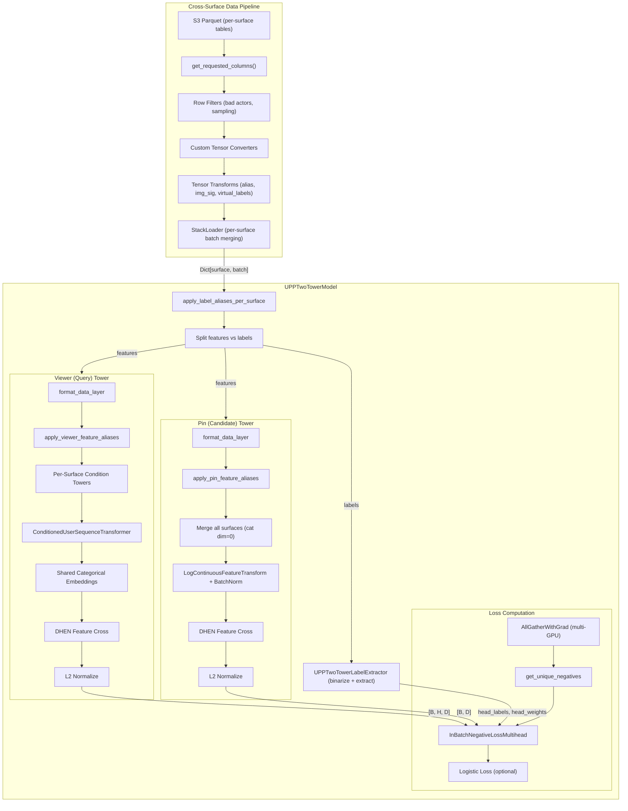
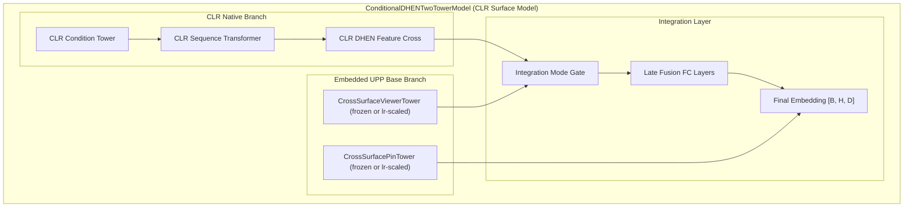

# UPP Retrieval Trainer — Architecture Deep Dive

## Overview

The UPP (Unified P13N Platform) Retrieval trainer is a **cross-surface two-tower retrieval model** that trains on data from 5 Pinterest surfaces simultaneously:

| Surface | Condition Type | Use Case |
|---------|---------------|----------|
| **HF** (Homefeed) | Interest, Board, Pin | General recommendation |
| **BMI** (Boards) | Board | Board-based retrieval |
| **P2P** (Related Pins) | Pin | Pin-to-pin similarity |
| **Search** | Query (text) | Query-based retrieval |
| **Notif** (Notifications) | Interest | Notification targeting |

It produces **multi-head viewer (query) embeddings** and **single pin (candidate) embeddings** for HNSW nearest-neighbor search at serving time. The core innovation: surface-agnostic backbone with surface-specific condition routing.

**Codebase location:** `machine-learning/trainer/ppytorch/mlenv/two_tower/upp_retrieval/`
**Config location:** `ml_resources/mlenv/upp_retrieval/`

---

## System Diagram



---

## Deep Dive 1: Condition Tower Routing

### Architecture Pattern

The viewer tower dispatches each surface's batch to a **surface-specific condition tower** before the shared sequence transformer. All condition towers produce a uniform output contract:

```
batch[CONDITION_TOKEN_OUTPUT_NAME]  : [B, 256]   # Fed to sequence transformer as extra tokens
batch[CONDITION_FC_OUTPUT_NAME]     : [B, 512]   # Fed directly to DHEN feature cross
```

### Tower Types

| Tower Class | Surfaces | Architecture | Key Difference |
|-------------|----------|-------------|----------------|
| `MultiConditionSlotTower` | HF only | Slot-based routing | Multiple condition types per row |
| `_ConcatConditionTower` | BMI, Search | LayerNorm → concat → FC → heads | Single tag, simple concat |
| `P2PConditionTower` | P2P | DHEN feature cross | Richer feature set (5 embeddings + scalars) |
| `NotifConditionTower` | Notif | Concat + id embedding | Shares interest_id table with HF |

### HF Multi-Slot Routing (the complex case)

HF is the only surface with multiple condition types per row. Each row is routed to exactly one condition based on which features are non-default:

| Priority | Condition Type | Features | Slot Assignment |
|----------|---------------|----------|-----------------|
| 1st | INTEREST | `interest_id` → ID slot (64d), `SS25C_query_embedding` → OS slot (256d) | Both slots |
| 2nd | BOARD | `board_id` (omnisage 256d) → OS slot | OS slot only |
| 3rd | PIN | `pin_id` (omnisage 256d) → OS slot | OS slot only |

**Routing logic** (`_create_routing_masks`):
```python
# Priority-ordered: first non-default condition wins
for each condition_tag in order:
    mask[condition_type] = ~all_features_are_default(batch) & ~already_routed
    already_routed |= mask[condition_type]
```

**Default detection** (`_is_default_condition_feature`):
- `interest_id`: sentinel range check (`> MAX_P2I_VOCAB` or `< MIX_P2I_VOCAB`)
- Float embeddings: all-zeros check
- Int features: all `<= 0` check

**Slot fusion:**
```python
# After routing, fuse slots with condition_type embedding
condition_os += cond_type_os_proj(condition_type_embedding(type_id))
condition_id += cond_type_proj_id_proj(condition_type_embedding(type_id))

# Generate outputs
fc_output = fc_generator(cat[os_slot, id_slot, type_embedding])  # [B, 512]
token_output = token_generator(os_slot)                           # [B, 256]
```

### Single-Tag Towers (BMI, Search, Notif)

All share `_ConcatConditionTower` base:
```
per-feature LazyLayerNorm → concat → FC encoder (hidden=1024) →
    token_head + cond_type_token_proj(type_emb)  → [B, 256]
    fc_head + cond_type_fc_proj(type_emb)        → [B, 512]
```

Surface-specific preprocessing:
- **BMI**: int8 sequence [B, 128, 32] → fp32 mean-pool → [B, 32]
- **Search**: Single 256d fp16 → cast fp32
- **Notif**: `interest_id` → shared BatchIdEmbeddingTable → [B, 64]; query_emb [B, 256]

### P2P Tower (custom DHEN)

Richer than concat towers — uses the same DHEN architecture as the main viewer:
- 5 dense embeddings (Omnisage pin, PinCLIP, SearchSage, LLM Relevance, PinnerSage)
- Scalar features (FVLv3 stats, shares, social) → log1p + BN
- Condition type embedding as additional DHEN field
- Output: DHEN cross → token_head + fc_head

### Shared Parameters

- `interest_id` embedding table: shared between HF's MultiConditionSlotTower and Notif's NotifConditionTower
- `condition_type_embedding`: shared across ALL five condition towers (same table, different type IDs)

---

## Deep Dive 2: Cross-Surface Data Flow

### End-to-End Pipeline

```
S3 Parquet → Column Selection → Row Filtering → Tensor Conversion →
Tensor Transforms (alias + label gen) → Batching → StackLoader →
Model receives Dict[surface, Dict[str, Tensor]]
```

### Stage 1: Column Selection

`SurfaceMetadataManager.get_requested_columns(surface)` unions:
- `viewer_feature_map(surface)` keys
- `pin_feature_map(surface)` keys
- `label_map(surface)` keys

Converted from F-form (`52/common.pin.interestVectorV8`) to P-form (parquet column names).

### Stage 2: Row Filtering

Per-surface `extra_filters` are AND-composed:

| Surface | Filters |
|---------|---------|
| HF | Bad actor, conditional feature, explicit row filter |
| BMI | Bad actor, explicit row filter |
| P2P | Bad actor (on `LABEL/long_user_id`) |
| Search | Bad actor, label sampling (downsamples impressions) |
| Notif | Bad actor (on `PASSED_IN_DATA/...userId`), notif-specific, explicit row |

### Stage 3: Custom Tensor Converters

| Converter | Surfaces | Purpose |
|-----------|----------|---------|
| `ImgSigFeatureConverter` | All | Deserialize image signature bytes |
| `BinaryTensorTabularMLFeatureConverter` | P2P, Search | Binary chunk IDs for IBN dedup |
| `VlmLabelStringListConverter` | Notif | VLM label ARRAY<STRING> |

### Stage 4: Tensor Transforms

`build_composed_transform(surface)` chains:
1. `two_tower_transform_fn` — feature aliases + `__is_positive__` generation
2. `convert_img_sig_tensor_to_long_transform` — type cast
3. `_maybe_generate_virtual_labels_notif` — (Notif only) synthetic relevance labels

### Stage 5: StackLoader

```python
class StackLoader:
    """One batch from each surface per training step."""
    def __next__(self):
        return {surface: next(loader) for surface, loader in self._loaders.items()}
```

**Batch size allocation** (from `batch_mixing_ratio`):

| Surface | Default Ratio | Example (total=4400) |
|---------|--------------|---------------------|
| HF | 0.50 | ~2200 |
| P2P | 0.20 | ~880 |
| BMI | 0.15 | ~660 |
| Search | 0.10 | ~440 |
| Notif | 0.05 | ~220 |

### Key Aliasing Patterns

All surfaces map to **HF canonical schema** before model forward:

```
P2P:    "95/num_repins"               → "95/is_repin"        (label alias)
P2P:    "RELATED_PINS.../pin_os"      → "52/common.pin.os"   (pin feature alias)
Search: "search_impression"           → "is_impression"       (label alias)
Notif:  "51/pinnability.viewer.userId" → "95/user_id"         (label alias)
HF/BMI: (no aliases — already canonical)
```

### Per-Surface Differences Summary

| Aspect | HF | BMI | P2P | Search | Notif |
|--------|----|----|-----|--------|-------|
| Label Map | HF (canonical) | HF | P2P (aliased) | Search (aliased) | Notif (aliased) |
| Condition Features | interest_id, SS25C, board_os, pin_os | board_os, board_recent | 5 embeddings + scalars | query_embedding | interest_id, query_emb |
| Image Sig Storage | LABEL struct | LABEL struct | RELATED_PINS struct | LABEL struct | Bare column |
| User ID Column | LABEL/user_id | LABEL/user_id | LABEL/long_user_id | LABEL/user_id | PASSED_IN_DATA/...userId |
| Virtual Labels | No | No | No | No | Yes (relevance) |

---

## Deep Dive 3: Full Forward Pass (Training)

### Input

```python
multi_surface_batch: {"hf": {key: Tensor}, "p2p": {...}, "search": {...}, ...}
```

### Phase 1: Label Preparation

```python
# 1a. Rename surface-specific labels to HF canonical schema
aliased_batch = _apply_label_aliases_per_surface(multi_surface_batch)

# 1b. Partition by entity prefix: "95/..." → labels, rest → features
feature_batch, label_batch = _get_features_and_labels_for_multi_surface(aliased_batch)

# 1c. Flatten labels: cat all surfaces along dim=0
labels_batch = _flatten_labels(label_batch)
# {"95/is_repin": [B_total], "95/is_closeup": [B_total], ...}

# 1d. Binarize + extract per-head labels and weights
head_labels, head_weights = label_extractor.get_labels_weights(labels_batch)
# .bool().float() fixes P2P's num_repins=2 → 1.0
# head_labels:  [num_heads, B_total] — binary 0/1 per head
# head_weights: [num_heads, B_total] — per-sample importance weights

# 1e. Derive masks and candidate IDs
sigs = _get_candidate_sigs(labels_batch)   # [B_total] pin signatures for IBN
true_labels_mask = head_labels == 1        # [num_heads, B_total]
```

### Phase 2: Viewer Tower Forward

```python
viewer_embeddings = viewer_tower_model(feature_batch)
# Output: [B_total, num_heads * embedding_dim]
# Reshaped to: [B_total, num_heads, embedding_dim]
```

**Internal flow:**
```
For each surface:
  format_data_layer(batch)                    # Registry key normalization
  → apply_viewer_feature_aliases(surface)     # Surface → canonical keys
  → [P2P: pad sequences 200→500]             # Surface-specific fixup
  → [Search/P2P: timestamp *= 1000]           # Unit conversion
  → _apply_per_surface_condition_towers()     # Pops condition feats, writes tokens+fc
  → [Optional FiLM adaptation]               # gamma*x + beta on condition outputs
  → cat across surfaces (dim=0)              # Merge

After merge:
  → filter to allowed features
  → ConditionedUserSequenceTransformer        # User sequence + condition tokens → attention
  → viewer_shared_embedding_layer             # Categorical: user_state, country, language
  → [Optional UOE module]                     # User-oriented embedding
  → DHEN feature_cross                        # LazyDimensionUnifier → LayerNorm → DHEN → Linear
  → [L2 normalize if configured]
```

### Phase 3: Pin Tower Forward

```python
pin_embeddings = pin_tower_model(feature_batch)
# Output: [B_total, embedding_dim]
```

**Internal flow:**
```
For each surface:
  format_data_layer(batch)
  → apply_pin_feature_aliases(surface)
  → filter to allowed features
  → cat across surfaces (dim=0)

After merge:
  → LogContinuousFeatureTransform             # Pop numerics → stack → log1p → BN
  → dense_norm_layer                          # Standard normalization
  → DHEN feature_cross                        # DimensionUnifier → LayerNorm → DHEN → Linear
  → [L2 normalize if configured]
```

### Phase 4: Loss Computation

```python
# 4a. In-Batch Negative Loss
loss, logit_matrix_list = get_in_batch_neg_loss(
    viewer_embeddings,    # [B, H, D]
    pin_embeddings,       # [B, D]
    true_labels_mask,     # [B, H]
    head_weights,         # [B, H]
    sigs,                 # [B]
    uid=labels_batch[query_id_tag],  # [B] — for per-user dedup
)
```

**Inside `get_in_batch_neg_loss()`:**
```python
# Multi-GPU negative expansion
if all_gather_negatives:
    negative_sigs = cat(AllGatherWithGrad(sigs))            # [B*world_size]
    negative_embeddings = cat(AllGatherWithGrad(pin_emb))   # [B*world_size, D]
    negative_uid = cat(all_gather_1d_tensor(uid))           # [B*world_size]

# Deduplicate negatives
unique_neg_items, unique_neg_embeddings, unique_neg_uids = get_unique_negatives(...)

# Update frequency counter
item_counter.update(negative_sigs)

# InBatchNegativeLossMultihead:
#   For each head h:
#     - Gather positive viewer embeddings where mask[:, h] == 1
#     - logits = pos_viewer @ unique_neg_embeddings.T    [S_h, N_unique]
#     - Mask same-item negatives (sig match)
#     - Mask same-user negatives (uid match)
#     - Scale: logits *= exp(learned_log_temperature)
#     - Correct: logits -= log(item_frequency)
#     - CrossEntropyLoss(logits, target=0)  (positive is column 0)
#   Average across num_heads
```

```python
# 4b. Scale
total_loss = in_batch_neg_rel_weight * loss

# 4c. Optional logistic loss
if logistic_loss_weight_for_b > 0:
    logits = sum(viewer_emb * pin_emb.unsqueeze(1), dim=2) + global_bias
    # logits: [B, H]
    head_loss = BCE_with_logits(logits, labels.T, weights.T)  # [H]
    total_loss += logistic_loss_weight_for_b * head_loss.mean()
```

### Phase 5: Output

```python
return {
    "total_loss": total_loss,
    "loss_components": {"in_batch_negative": ..., "logloss": ...},
    "viewer_embeddings": [B, H, D],
    "pin_embeddings": [B, D],
    "logits": List[Tensor],          # per-head logit matrices (for recall@K metrics)
    "predictions": [B, H],           # sigmoid predictions (if log loss enabled)
    "head_labels": [H, B],
    "head_weights": [H, B],
}
```

---

## Deep Dive 4: Fine-Tuning Path (Base → Surface-Specific CLR)

*Source: PR #251610 — "CLR HF fine-tuning from a pretrained UPP base retrieval snapshot"*

### Design Philosophy: Module Embedding, Not Weight Copying

The fine-tuning architecture does **not** copy trained weights into a new model with renamed keys. Instead, it embeds the entire pretrained UPP base tower **as an `nn.Module` child** inside the surface-specific CLR model. This preserves:
- All internal parameter names (snapshot compatibility)
- The full forward pass logic (no reimplementation)
- Module-level freeze/unfreeze granularity



### The 4-Mode Integration Ladder

The `base_viewer_integration_mode` config controls how base tower output enters the CLR model:

| Mode | Behavior | Use Case |
|------|----------|----------|
| `none` | Base tower disabled; CLR trains independently | Baseline comparison |
| `into_ft_dhen` | Base viewer output concatenated as an additional DHEN field | Minimal integration; base embedding treated as one more feature |
| `late_fusion` | CLR DHEN output + base viewer output → learned FC fusion | Full integration; model learns optimal combination |
| `both` | Both `into_ft_dhen` AND `late_fusion` active simultaneously | Maximum capacity; base signal available at two stages |

The pin tower has its own independent `base_pin_integration_mode` with the same 4 modes.

### Snapshot Loading Flow

```python
# In trainer_v2.py: UPPRetrievalTrainer construction for CLR fine-tuning

# Step 1: CLR model constructed with base towers as nn.Module children
model = ConditionalDHENTwoTowerModel(
    base_modules_init_fn=lambda: {
        "base_viewer_tower": CrossSurfaceViewerTower(...),
        "base_pin_tower": CrossSurfacePinTower(...),
    }
)

# Step 2: Snapshot patterns remap UPP checkpoint keys → embedded module paths
patterns = model.get_snapshot_load_patterns()
# e.g., "viewer_tower_model.*" → "base_viewer_tower.*"

# Step 3: Load pretrained UPP snapshot with pattern remapping
restore_from_snapshot(
    model,
    snapshot_path=app_config.pretrained_snapshot_path,
    load_patterns=patterns,
    strict=False,  # CLR-native params not in UPP snapshot
)

# Step 4: Remaining CLR-native params initialized from scratch (Xavier/etc.)

# Step 5: Optimizer param groups with differential LR
base_params → lr = base_lr * 10^(-base_module_log10_base_lr)  # e.g., 1e-5
clr_params  → lr = base_lr                                     # e.g., 1e-3
```

### Freeze/Unfreeze + Optimizer Param Groups

The `base_module_log10_base_lr` config controls the base tower learning rate relative to CLR:
- `log10_base_lr = -2` → base towers train at 1/100th of CLR LR (slow adaptation)
- `log10_base_lr = -inf` (or very large negative) → effectively frozen
- `log10_base_lr = 0` → base and CLR train at same rate (full fine-tuning)

The trainer constructs separate optimizer param groups:
```python
param_groups = [
    {"params": clr_native_params, "lr": base_lr},
    {"params": base_module_params, "lr": base_lr * 10**(-log10_base_lr)},
]
```

### Module-Level Interface: Decomposed Forward

PR #251610 decomposes the base tower's `forward()` into two callable sub-phases:

```python
class CrossSurfaceViewerTower:
    def forward_pre_cross_features(self, batch) -> Dict[str, Tensor]:
        """Everything before DHEN: condition towers, sequence transformer, embeddings.
        Returns intermediate feature dict ready for DHEN."""

    def forward_feature_cross(self, features) -> Tensor:
        """DHEN feature cross + normalization. Returns final embedding."""
```

This decomposition enables the `into_ft_dhen` integration mode: CLR can inject the base tower's pre-cross features into its own DHEN as additional fields, allowing cross-feature interactions between base and CLR representations.

### Batch Routing Convention

When CLR fine-tunes with base towers, both need to process the same batch. The convention:
- CLR-native dataloader produces batches with standard feature keys
- A `_ft` suffix is appended to keys destined for the base tower's forward pass
- The base tower's `format_data_layer` strips the `_ft` suffix before processing

This prevents key collisions when both towers read from the same batch dict:
```python
# Same batch, different consumers:
batch["52/common.pin.os"]      → CLR native tower reads this
batch["52/common.pin.os_ft"]   → Base tower reads this (strips _ft internally)
```

### What This Enables

1. **Any UPP base checkpoint → any surface CLR model** without manual key remapping
2. **Continuous improvement flow:** UPP base trains cross-surface → new snapshot → surface CLR reloads and fine-tunes → online metrics improve
3. **Controlled knowledge transfer:** The integration mode ladder lets teams dial from "ignore base" to "full fusion" and measure impact at each step
4. **No base model regression:** Differential LR ensures base parameters drift slowly, preserving cross-surface knowledge while adapting to surface-specific signals

---

## Key Files Reference

| File | Lines | Role |
|------|-------|------|
| `model.py` | 445 | Top-level model: forward, eval_forward, init, deploy |
| `modules.py` | ~1066 | Tower implementations + all 5 condition towers + decomposed forward |
| `metadata.py` | ~1100 | SurfaceMetadataManager: feature maps, aliases, transforms, filters |
| `train.py` | 600 | Trainer: dataloading, DDP, solver, eval orchestration |
| `label_extractor.py` | 56 | Binarizing label extractor (fixes P2P count-to-binary) |
| `eval_utils.py` | 282 | Offline eval: per-surface recall@K computation |
| `constants.py` | 36 | Surface IDs, shared pretrain labels |
| `ml_resources/.../configs.py` | ~500 | All config dataclasses |
| `ml_resources/.../feature_names.py` | ~220 | Feature name constants + FEATURE_TO_SLOT mapping |
| `ml_resources/.../head_config.py` | — | HeadConfig registry (which labels map to which heads) |
| `conditional_learned_retrieval/modules_v2.py` | ~400 | HomeFeedConditionedViewerTower with dual-branch architecture |
| `conditional_learned_retrieval/model.py` | ~350 | ConditionalDHENTwoTowerModel: base_modules_init_fn + snapshot patterns |
| `trainer_v2.py` | ~300 | Sister trainer construction, param groups, snapshot loading |
| `config_bundle_defs.py` | — | Fine-tuning config fields (integration modes, LR scaling) |
| `upp_retrieval/hf_clr_finetune.md` | 732 | Design doc for the fine-tuning approach |

---

## Observations

- **Load-bearing abstraction:** `SurfaceMetadataManager` is the single integration point. Adding a surface = one block in `_build_surface_metadata()` + condition tower class. No model.py changes needed.

- **Complexity hotspot:** The viewer tower's `_merge_batch_for_forward()` has inline surface-specific branching (P2P sequence padding, timestamp multiplication) that doesn't scale. Should be metadata-driven transforms.

- **Deploy gap:** Condition tower inputs are transform-injected (not parquet columns), causing training/serving contract mismatch. PR #252762 patches via `extra_input_keys`, but the deploy path lacks first-class "transform-generated feature" modeling.

- **Multi-head semantics:** Each head produces an independent viewer embedding. At serving time, only the primary head is used for ANN retrieval. Multi-head exists for auxiliary training signal (repin, closeup, click improve the primary embedding).

- **Shared parameters across surfaces:** `interest_id` embedding table shared between HF + Notif; `condition_type_embedding` shared across all 5 towers. Parameter tying ensures cross-surface condition semantics stay consistent.

- **IBN uid masking (PR #252762):** Previously IBN loss didn't have access to user IDs, so couldn't mask same-user negatives. The PR threads `query_id_tag` through to enable per-user dedup — important for avoiding trivial negatives in multi-surface training where the same user may appear across surfaces.

- **Fine-tuning as module embedding (PR #251610):** The decision to embed base towers as `nn.Module` children rather than copy/rename weights is architecturally significant. It means the CLR model's TorchScript export can include or exclude the base branch by toggling the integration mode — no model surgery required between modes.

- **Decomposed forward is the interface contract:** `forward_pre_cross_features()` / `forward_feature_cross()` creates a stable boundary between base and CLR. This is the seam where future improvements (LoRA injection, adapter layers, mixture-of-expert routing) would attach.

- **Batch routing via `_ft` suffix:** A pragmatic choice that avoids key collisions in a shared batch dict. The downside: feature names now carry routing semantics, making the batch dict a de facto message bus. Any tool that inspects batch keys must understand this convention.
